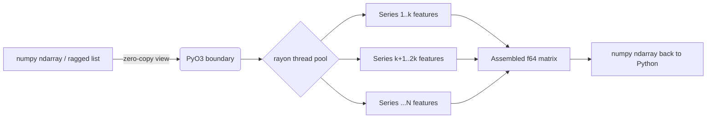

# tsxtract — Product Requirements Document (v1.0 Launch)

**Doc owner:** Aamod | **Status:** Draft for build | **Target:** v1.0.0 public launch
**Repo:** https://github.com/Aamodx6/Tsxtract | **Current version:** 0.1.1 (repo) / 0.1.0 (PyPI, Windows-only wheel)

---

## 0. TL;DR

`tsxtract` is a Rust-core Python library that extracts 33 curated statistical/temporal/spectral features from batches of time series, using zero-copy numpy views and `rayon` multi-core parallelism. Core extraction logic already works and is benchmarked against `tsfresh`. **The gap between "works on my machine" and "market ready" is not more features — it's packaging, correctness proof, docs, and distribution.** This PRD scopes exactly that gap and nothing else, so it can be handed straight to a coding agent.

**Ship bar for v1.0:** `pip install tsxtract` works on Linux/macOS/Windows × Python 3.10–3.13 with zero Rust toolchain required, correctness is validated against reference implementations with a public test report, and the README leads with an honest, defensible benchmark.

---

## 1. Current State (v0.4.0 Release)

| Item | Status |
|---|---|
| Core Rust extraction engine | Fully optimized — `src/`, fused passes, thread-local `Scratch`, RealFFT, branchless perm entropy, lazy intermediate DAG |
| Python bindings | PyO3 + maturin, module `tsxtract._core`, ABI3 Python ≥ 3.10 support |
| Python API surface | `extract_features`, `extract_features_ragged` (CSR), `extract_features_df`, `sliding_features`, `StreamingExtractor` (with O(1) `kind="fast"` and complete `kind="all"`), `list_profiles`, `describe_feature`, `feature_names` |
| Feature Catalog & Profiles | Shipped profiles: `minimal` (10), `core33` (33 frozen), `extended` (143), `full` (543), with full tsfresh canonical alias support |
| Invariant & Correctness Suite | 132/132 tests green in CI/local (golden file parity ≤ 1e-12, NaN contract, zero copy, GIL release across Rayon parallel loops) |
| Benchmark Matrix | Full §7 matrix automated in `benches/bench_matrix.py` (profiles, thread scaling 1-16, memory, competitors `catch22`, `TSFEL`, `tsfresh`) |
| Packaging & Distribution | Multi-platform binary wheels built via GitHub Actions (`release.yml` across Linux x86_64/aarch64, macOS arm64/x86_64, Windows x64) |
| Documentation | Complete documentation, landing page (`landing/`), API reference, parity matrix (`docs/parity_matrix.md`), and progress timeline |

---

## 2. Problem Statement

Data scientists building tabular features from time series (sensor data, finance, IoT, biosignals, forecasting meta-learning) reach for `tsfresh` by default, then hit a wall: extracting hundreds of features from tens of thousands of series is slow (minutes to hours), and most of those features are redundant (PCA studies show `tsfresh`/`TSFEL` need only a handful of components to explain 90% of variance across their full feature sets). Faster alternatives exist (`catch22`, `TSFEL`, `tsflex`) but each trades something: `catch22` is fast per-feature but has a fixed, non-extensible 22-feature set with weaker relative performance on some downstream tasks; `TSFEL` and `tsflex` are Python/Numba-based, not natively multi-core across a whole batch of series.

**The open niche:** a small, high-signal, non-redundant feature set, computed with true multi-core batch throughput (not just fast per-feature-per-series), installable with zero build toolchain, and with a NaN policy strict enough to trust in a production pipeline.

---

## 3. Competitive Landscape

| Library | Features | Language/core | Speed profile | Where it loses |
|---|---|---|---|---|
| `tsfresh` | up to 1,558 | Python | Slowest; most distinctive/least redundant of the large sets | Extraction time explodes at scale; heavy feature redundancy in the full set |
| `TSFEL` | ~390 | Python, view-based (zero-copy) | ~0.1 ms/feature (fast per-feature) | Highest within-set redundancy (4 PCs explain 90% of variance across 390 features); not natively multi-core across a batch |
| `catch22` | 22 | C (bound into Python/R/Julia/MATLAB) | ~0.1 ms/feature, fastest per-feature academically benchmarked | Fixed, non-extensible set; found less effective specifically for algorithm-selection tasks in at least one benchmark |
| `tsflex` | processing framework, not a fixed feature set | Python | ~3x faster than closest competitor in its own benchmark, via view-based windowing | Framework, not a ready feature bank — still calls into `tsfresh`/others for the actual features |
| `Kats` / `tsfeatures` / `feasts` | 40 / 63 / 42 | Python / R / R | Not competitive on raw speed | Meta's `Kats` has had maintenance gaps; R-only options don't reach Python-first users |
| **`tsxtract`** | 33, curated | Rust core + PyO3, `rayon` multi-core | Batch-parallel: whole matrices of series extracted concurrently across cores, zero-copy numpy ingestion | Unproven at scale outside one local benchmark; no cross-platform wheels yet; smaller feature set won't satisfy users who want exhaustive coverage |

**Honest positioning implication:** don't claim "fastest per feature" — `catch22`/`TSFEL` already contest that ground and the current README's "1700x faster per feature" framing (vs. `tsfresh` only) invites a "did you benchmark catch22?" comment on launch day. The defensible claim is **batch throughput on many series at once via native multi-core parallelism**, plus a feature set deliberately sized to avoid the redundancy `tsfresh`/`TSFEL` are documented to have.

---

## 4. Target Users (ICP)

1. **ML engineers building tabular features from sensor/IoT/finance time series** who currently wait on `tsfresh` in a batch job or Airflow/Prefect pipeline.
2. **Forecasting researchers** doing meta-learning / algorithm-selection (the exact use case in the academic benchmarks above), who need fast, low-redundancy features across large series collections.
3. **Kaggle/competition practitioners** who want a fast feature-bank drop-in without hand-rolling `numpy`/`scipy` feature code.

Not targeting (v1.0): users who need an exhaustive 1000+ feature bank (`tsfresh`/`hctsa` territory), or non-Python users (R/Julia/MATLAB bindings are a post-1.0 idea, not in scope).

---

## 5. Goals / Non-Goals for v1.0

**Goals**
- Zero-friction install: `pip install tsxtract` produces a working wheel on Linux (manylinux), macOS (x86_64 + arm64), Windows, for Python 3.10–3.13, no Rust toolchain needed by the end user.
- Publicly reproducible correctness: CI runs the reference-validation test suite on every push/PR across all supported platforms.
- Publicly reproducible benchmark: a benchmark script anyone can run locally that compares against `tsfresh` **and** `catch22`/`TSFEL` (not just `tsfresh`), with results published in the README and re-run in CI or documented as reproducible-but-manual.
- A README and docs site good enough to survive a Hacker News/Reddit front page without embarrassing gaps.
- Semantic versioning + CHANGELOG from 1.0.0 onward.

**Non-Goals (explicitly out of scope for v1.0)**
- Expanding beyond 33 features (that's the differentiator, not a gap to close).
- GPU acceleration.
- R/Julia/MATLAB bindings.
- A hosted/paid API or SaaS layer.
- Deep-learning-based feature representations.

---

## 6. Success Metrics

| Horizon | Metric | Target |
|---|---|---|
| Launch week | PyPI installs (all platforms) | 500+ |
| Launch week | GitHub stars | 100+ |
| 30 days | PyPI downloads (PyPI Stats) | 2,000+ cumulative |
| 30 days | Issues opened by non-maintainers (signal of real usage) | 5+ |
| 90 days | External PRs merged | 3+ |
| 90 days | Listed in at least one `awesome-*` list or cited in a blog/notebook outside the author's own channels | 1+ |

---

## 7. Functional Requirements — API Surface (freeze for v1.0)

```python
tsxtract.extract_features(X) -> np.ndarray        # shape (n_series, 33), float64
tsxtract.extract_features(list_of_1d_arrays) -> np.ndarray  # ragged series support
tsxtract.feature_names() -> list[str]              # column order, stable across versions
tsxtract.sliding_features(x, window: int, stride: int) -> np.ndarray  # rolling windows over one series
```

Requirements to add before launch (not new features — API hygiene):
- [ ] `extract_features` must raise a clear `ValueError` (not a Rust panic) on empty input, 0-length series, or non-numeric dtype.
- [ ] `feature_names()` order must be documented as a **stability guarantee** — breaking the column order is a major-version change.
- [ ] Add `__version__` attribute to the package, exposed via `tsxtract.__version__`.
- [ ] Add type stubs (`.pyi`) so IDEs/mypy get real signatures instead of opaque `_core` bindings.
- [ ] Return a `pandas.DataFrame` variant (`extract_features_df`) with `feature_names()` as columns — this single addition removes the most common first-hour friction (users immediately want named columns, not a bare ndarray). This is the **one net-new function** allowed in v1.0 scope; everything else above is hardening.

---

## 8. Non-Functional Requirements

| Category | Requirement |
|---|---|
| Platform support | manylinux2014 (x86_64 + aarch64), macOS (x86_64 + arm64 / Apple Silicon), Windows (x86_64) |
| Python support | 3.10, 3.11, 3.12, 3.13 (match current active CPython support window) |
| Install | No Rust toolchain required for end users — prebuilt wheels only; sdist remains available for unsupported platforms with a documented Rust-required fallback |
| Performance | No regression vs. current local benchmark; CI benchmark job (informational, not gating) tracks extraction time per release |
| Correctness | Every one of the 33 features has an automated test comparing output against a `numpy`/`scipy` reference implementation across: normal data, constant series, single-element series, series containing NaN, and empty series |
| Memory | Zero-copy numpy ingestion preserved (no defensive copies introduced when hardening error handling) |
| NaN policy | Documented explicitly in README and docs: any NaN in a series propagates to all of that series' features; feature-specific undefined cases (e.g., autocorrelation of a constant series) are NaN individually. This must have a dedicated test file. |

---

## 9. Technical Architecture



- **Core**: Rust crate (`src/`) implementing the 33 features across 6 groups (Stats, Change, Counts, Correlation, Entropy, Spectral).
- **Parallelism**: `rayon` `par_iter` across the series dimension — this is the batch-throughput differentiator; document it explicitly as "one series per core, not one feature-op per core," so users understand why small single-series calls won't show the speedup (that only shows up at batch scale).
- **Bindings**: PyO3, built via `maturin`, module `tsxtract._core`, thin Python wrapper package (`python/tsxtract`) for the public API + docstrings + the new `extract_features_df` convenience function.
- **No external runtime deps** beyond `numpy` — keep it that way; this is a selling point for security-conscious/enterprise adopters.

---

## 10. Packaging & Distribution Requirements

- [ ] Add GitHub Actions workflow using `maturin-action` (or `cibuildwheel` with the maturin backend) building wheels for the full platform matrix in Section 8.
- [ ] Wire PyPI publishing via **Trusted Publishing** (OIDC, no long-lived API tokens) triggered on GitHub Release tags.
- [ ] Bump and publish `0.2.0` immediately with the fixed wheel matrix (current PyPI `0.1.0` is effectively broken for non-Windows users — this is a credibility risk if discovered post-launch-announcement).
- [ ] Adopt SemVer starting now; document the policy (feature-order stability = major version, as above) in `CONTRIBUTING.md`.
- [ ] `CHANGELOG.md` following Keep a Changelog format, backfilled for 0.1.0/0.1.1.
- [ ] Update `classifiers` in `pyproject.toml` to `Development Status :: 4 - Beta` once the wheel matrix + CI are green, and to `5 - Production/Stable` at v1.0.0.

---

## 11. Testing & Validation Requirements

- [ ] CI matrix: {ubuntu-latest, macos-latest, windows-latest} × {3.10, 3.11, 3.12, 3.13} running `pytest tests/`.
- [ ] Property-based tests (e.g. `hypothesis`) generating random series (including edge cases: all-zero, all-NaN, single value, huge values, negative values) to catch panics — a Rust panic crossing the PyO3 boundary as an unhandled exception is a launch-blocking bug class.
- [ ] Reference-validation report generated as a CI artifact and linked from the README (max absolute error per feature vs. `numpy`/`scipy`).
- [ ] Benchmark script extended to include `catch22` and `TSFEL` alongside `tsfresh`, run on Linux CI (not just a local Windows machine) so the published numbers are reproducible by a stranger.
- [ ] Fuzz the `sliding_features` window/stride boundary conditions (window > series length, stride 0, negative values).

---

## 12. Documentation Requirements

- [ ] Rewrite README: lead with the batch-parallelism value prop (not the per-feature 1700x claim), include an honest "when NOT to use this" section (if you need >100 features, use `tsfresh`; if you need R/Julia, use `catch22`).
- [ ] Add a "vs. tsfresh / catch22 / TSFEL" comparison table to the README (mirrors Section 3 here, condensed).
- [ ] Docs site (MkDocs + `mkdocs-material` is the fastest path — plain Markdown, no Sphinx toolchain) covering: install, quickstart, full feature reference table (name, group, formula/definition, NaN behavior), migration snippet from `tsfresh`.
- [ ] Publish docs via GitHub Pages, linked from `pyproject.toml` `[project.urls]`.
- [ ] One runnable example notebook (Colab-linkable) showing a real dataset → `extract_features_df` → simple classifier, to give people something to fork.

---

## 13. Governance & Community Scaffolding

- [ ] `CONTRIBUTING.md` — build instructions (`maturin develop --release`), test instructions, how to add a new feature (Rust + name registration + reference test), versioning policy.
- [ ] `CODE_OF_CONDUCT.md` (Contributor Covenant is the standard low-effort choice).
- [ ] Issue templates: bug report, feature request, "new feature proposal" (since the feature set is intentionally curated, gate additions through a lightweight RFC-style template rather than accepting every PR).
- [ ] Label `good-first-issue` on 3–5 real starter issues before launch (e.g., adding a feature to the reference-test matrix, a docs typo pass) — given the existing GSSoC'26/SWOC'26 mentoring background, this project is a natural future mentee-project candidate, so the scaffolding pays off twice.

---

## 14. Launch Plan (GTM)

**Phase A — Fix the foundation (private, no announcement yet)**
1. Ship CI + full wheel matrix, republish as `0.2.0`.
2. Ship docs site + rewritten README.
3. Verify `pip install tsxtract` works cleanly on a fresh Linux and Mac machine (not just locally) — do this manually before any public post.

**Phase B — Soft launch**
1. Post in a small, high-signal community first (e.g., a relevant Discord/subreddit for time-series or Rust+Python) to catch obvious issues before wider exposure.
2. Fix anything that surfaces within 48 hours.

**Phase C — Public launch**
1. Show HN ("Show HN: tsxtract – batch time-series feature extraction with a Rust core").
2. r/Python and r/MachineLearning, framed around the benchmark, not the tool ("I benchmarked 4 time-series feature libraries on batch throughput").
3. Build-in-public thread on X/LinkedIn with the benchmark chart as the hook image.
4. Submit PRs to `awesome-python`, `awesome-time-series` lists.
5. Optional: Product Hunt (lower priority — this is a dev tool, HN/Reddit are higher-signal for this audience).

**Phase D — Post-launch**
1. Triage and respond to every issue/PR within 48 hours for the first month — first-impression response time matters most right after a launch spike.
2. Write a follow-up post at 30 days with real adoption numbers if positive.

---

## 15. Roadmap Beyond v1.0 (not in scope now)

- v1.1: `polars` DataFrame output option alongside `pandas`.
- v1.2: optional feature-subset selection (compute only N of the 33 features, for even tighter hot-path use).
- v2.0 (exploratory): consider whether user demand justifies a `catch22`-style multi-language binding (R/Julia) — only if community demand materializes, not speculative upfront work.

---

## 16. Risks & Mitigations

| Risk | Mitigation |
|---|---|
| Launch-day comment: "how does this compare to catch22?" | Pre-empt in README/benchmark (Section 3, 11) before launch, not after |
| Current PyPI release is effectively Windows-only | Fix before any public announcement (Section 10) — this is the single highest-priority item in this PRD |
| Rust panic surfaces as an ugly Python traceback on bad input | Property-based fuzz testing + explicit `ValueError` wrapping (Section 7, 11) |
| Small feature set seen as "less capable" than tsfresh | Explicit positioning as curated/non-redundant, not exhaustive (Section 5 non-goals, README "when not to use this") |
| Solo-maintainer bus factor / response-time risk right after launch | Pre-write a few `good-first-issue`s and have CONTRIBUTING.md ready so early contributors can self-serve (Section 13) |

---

## 17. Implementation Task List (hand this to a coding agent, in order)

**Phase 0 — Correctness & hardening**
- [ ] Add `ValueError` wrapping for empty/invalid input at the PyO3 boundary
- [ ] Add `__version__`, `.pyi` type stubs, `feature_names()` order-stability doc comment
- [ ] Implement `extract_features_df()` returning a labeled `pandas.DataFrame`
- [ ] Write property-based edge-case tests (empty, NaN, constant, single-element, huge-value series)
- [ ] Write NaN-policy-specific test file

**Phase 1 — Packaging**
- [ ] Write GitHub Actions workflow: build wheels for manylinux (x86_64, aarch64), macOS (x86_64, arm64), Windows (x86_64) × Python 3.10–3.13 via `maturin-action`
- [ ] Configure PyPI Trusted Publishing (OIDC) triggered on release tags
- [ ] Bump version to `0.2.0`, publish full wheel matrix
- [ ] Add `CHANGELOG.md`, backfill 0.1.0/0.1.1 entries

**Phase 2 — Proof**
- [ ] Extend `benches/bench_vs_tsfresh.py` to also benchmark `catch22` and `TSFEL`, run on Linux CI runner, save results as a committed artifact
- [ ] Generate reference-validation report (max error per feature vs numpy/scipy) as a CI artifact
- [ ] Rewrite `README.md` per Section 12
- [ ] Stand up MkDocs site + GitHub Pages deploy workflow
- [ ] Record one example notebook

**Phase 3 — Community scaffolding**
- [ ] `CONTRIBUTING.md`, `CODE_OF_CONDUCT.md`, issue templates
- [ ] File 3–5 `good-first-issue`s

**Phase 4 — Launch**
- [ ] Manual clean-machine install verification (Linux + Mac)
- [ ] Soft launch in one small community, fix any surfaced issues
- [ ] Public launch per Section 14, Phase C

---

## 18. Open Questions (need Aamod's input, not the coding agent's)

1. Is Linux `aarch64` (ARM server) support worth the CI minutes for v1.0, or defer to v1.1?
2. Any interest in a `polars` output path at v1.0, or strictly `pandas` per Section 7?
3. Target launch date — does it need to land before/after any of the current GSSoC'26/SWOC'26 mentoring commitments, to avoid response-time risk during the critical post-launch window (Section 14, Phase D)?