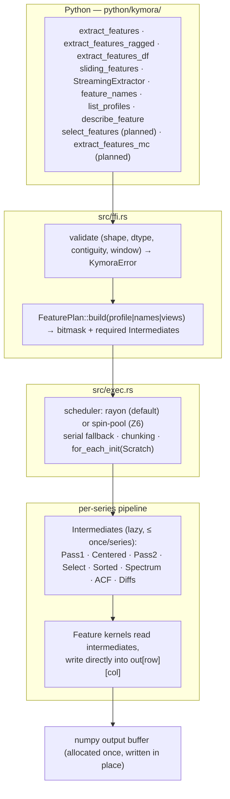

# Kymora — Architecture (single source of truth)

**Supersedes:** the previous `arch.md` (v1.0 hardening), `arch_max.md`, `arch_zenith.md`. Delete those after the migration checklist in Appendix C passes.
**Audience:** maintainers and Claude Code. **Style:** normative ("MUST/SHOULD"), phase-gated, evidence-driven.
**Scope:** product contract · target architecture · kernels · catalog · API · streaming · performance ceilings · benchmark architecture · correctness · roadmap · risks · claims policy.

---
    
## 0. How to use this document

1. **Truth hierarchy:** (a) current *behavior* = the code and its tests; (b) *target design* = this file; (c) *measured performance* = committed benchmark artifacts under `benchmarks/results/`. If they disagree, record it in `docs/arch_audit.md` and in the Decision Log (§3), then fix the code or this file — never leave a silent divergence.
2. **Phase protocol:** work phase by phase (§15). Each phase has a **gate**. Do not start a phase before the previous gate is green. Track progress in `benchmarks/STATE.md` (benchmarks) and `docs/PROGRESS.md` (build).
3. **Evidence rule:** no performance or correctness claim in README, landing page, PyPI text or release notes without an artifact path + commit hash (§14).
4. **Honesty rule:** record every loss, bug, and limitation (Loss Ledger, §13). A thin lead or a known weakness is documented, not hidden.
5. **Estimates vs measurements:** numbers marked *(est.)* are first-principles estimates to be falsified by measurement.

Status legend: ✅ reported done (verify) · 🟡 in progress · ⬜ planned · ❓ decision needed.

---

## 1. Product Definition

**What:** Rust-core, Python-API time-series feature extraction for *batches* of series. Zero-copy NumPy ingestion (PyO3), GIL released, rayon parallelism across the series dimension.
**Who:** ML pipelines, quant finance, sensor telemetry, high-throughput research.
**Core promise:** orders-of-magnitude higher throughput than tsfresh / TSFEL / catch22 on batch workloads, with predictable memory and well-defined edge-case behavior.

**Non-goals (v1.x):** custom user-defined features in Python on the hot path; GPU in the core wheel; DataFrame melting/grouping semantics; forecasting; online learning.

**When NOT to use Kymora (publish this):**
- Tiny calls (a handful of series): fixed per-call overhead (~70 µs observed in B0 smoke, to be decomposed — §13) dominates; numba/numpy can win.
- Need for features outside the shipped profiles or custom Python features.
- Single very short series where Python overhead is the whole cost.

---

## 2. Status Snapshot & Open Findings

### 2.1 Phase status (verify each ✅ via audit, Phase R0)

| Track | Item | Status |
|---|---|---|
| Build | Hot-path rewrite, fused kernels, scratch, in-place output (P1) | ✅ reported (v0.4.0) |
| Build | SIMD/dispatch, f32/CSR/`out=` paths (P2) | ✅ reported — verify per item |
| Build | Registry + plan + intermediates + profiles (P3) | ✅ reported (`core33`, `minimal`, `extended`, `full`) |
| Build | Catalog expansion & parity matrix (P4) | 🟡 verify counts vs 777 target |
| Build | Sliding/streaming fast paths, numerical anchor guards (P5) | ✅ reported (4096-step re-anchoring, block-parallel windows) |
| Zenith | Z-items (§10) | ⬜ not started (gated on re-baseline) |
| Bench | B0 environment & harness (10 adapters, runner, schema, smoke) | ✅ complete |
| Bench | Amendments A1–A9 (§11.9) | 🟡 applying |
| Bench | B1 correctness & agreement → B8 report | ⬜ |

### 2.2 Open findings (each becomes a Loss Ledger / Decision Log entry)

| ID | Finding | Evidence | Action |
|---|---|---|---|
| F1 | **Throughput claims disagreed:** README 1.25 ms / 800,256 series/s; v0.4.0 release notes cited ~1.80 ms / 555k series/s for `core33` | README vs release notes | ✅ RESOLVED 2026-10-04: interleaved `suites/reproduce_readme.py` (+0.3.2/0.4.0 bisect) shows BOTH old figures irreproducible on this machine at every version — README+`CLAIMS.md` rewritten from artifact (3.18 ms med / 314,450 s/s; raw 262×/799×/6,570×, per-feature 393×/169×/279×). Artifact: `benchmarks/results/F1_REPORT.md` |
| F2 | Small-call overhead: 2×32 smoke = 0.07–0.11 ms (kymora) vs 0.02 ms (numba) | B0 smoke | Fixed-overhead decomposition (A7); ledger `HIGH-LATENCY-SMALL-CALL` |
| F3 | Feature-name lists differ between README and old `arch.md` | audit | `feature_names()` is truth; list mismatches in `docs/arch_audit.md` |
| F4 | Naming: PyPI `kymora`, import `kymora`, crate `kymora`; unrelated JAX PyPI project `tsxtract` keeps the bare name (deprecated `tsxtract` shim warns); two GitHub accounts/repos | repos, PyPI | Decision D3 (decided 2026-10-04: rename to Kymora, 0.7.0) |
| F5 | Hardware wording: i7-13620H = 10 cores (6P+4E) / 16 threads, not "16 cores" | env.json | Reword all claims (§14) |
| F6 | Streaming claim "O(1)" does not hold for quantile/spectral/entropy features | code | O(1) vs O(n) tiers documented (§8) |
| F7 | Landing site is a client-rendered SPA (empty HTML to crawlers), default Vercel domain | fetch | Prerender, OG tags, domain (§14.4) |

---

## 3. Contracts, Invariants, Decision Log

### 3.1 Invariants (never break; each has a test)

| # | Invariant | Enforced by |
|---|---|---|
| I1 | `profile="core33"` is the default. Names/order from `feature_names()` are **frozen for 1.x**; new features are append-only | `tests/golden/core33_names.json` + golden output file |
| I2 | **NaN model:** a series containing NaN → all-NaN row. An undefined single feature → that feature NaN. ±inf handling is fixed and tested. Never panic | `tests/test_nan_contract.py`, property tests |
| I3 | **Error model:** structural problems raise — zero series, zero-length series, window/stride < 1, window > length → `ValueError`; wrong dtype/shape → `TypeError`. One `KymoraError → PyErr` conversion point | tests + hypothesis |
| I4 | **No panic crosses FFI.** `panic = "unwind"` (never abort) + `catch_unwind` backstop | fuzz, property tests |
| I5 | **GIL released** for the whole parallel region; inputs converted to plain slices before release | test: 2 Python threads scale ≈2× |
| I6 | Input is **borrowed, never defensively copied** (contiguous f64/f32). Output float64 unless `out_dtype` given | allocation-counting test |
| I7 | **Determinism:** results independent of thread count and scheduling (bitwise, per-series independence); SIMD vs scalar equal within §12.2 tolerances | `suites/agreement`, thread-sweep test |
| I8 | `unsafe` only in `src/ffi.rs` (numpy buffer boundary: centralized `out_slice_mut` helpers + documented SAFETY contract) and `src/kernels/` (designated SIMD home, currently unsafe-free); every other module carries `#![deny(unsafe_code)]` | rustc (deny attributes; negative-tested) |
| I9 | No numeric logic in Python | review + lint |
| I10 | SemVer: additive changes (new features/profiles/params) = minor; changing existing feature values/order/NaN semantics = major | CHANGELOG gate |

### 3.2 Decision Log

| ID | Decision | State |
|---|---|---|
| D1 | `feature_names()` from the built library is the single source of truth for feature names; README/docs generated from it | ✅ |
| D2 | **Non-contiguous input:** default `contiguous="error"` (preserves documented `ValueError`); `contiguous="copy"` opt-in performs one explicit copy with a one-time warning stating the cost. Never copy silently | ✅ |
| D3 | **Canonical import/package name (decided 2026-10-04).** PyPI `kymora`, import `kymora` only, crate `kymora`; `tsxtract` remains as a deprecated warning shim (removal >= 0.8.0; the older `tsxtractor` alias was deleted outright) because an unrelated PyPI `tsxtract` (JAX) exists and can collide — never `pip install tsxtract` | ✅ |
| D4 | `compute()` of `StreamingExtractor` is **not** O(1) for all features; API exposes `compute(kind="fast"\|"all")` | ✅ |
| D5 | Exact (unpadded) FFT is default; padded `fft_mode="fast"` is opt-in and documented non-identical | ✅ |
| D6 | `precision="f32"` is opt-in; default stays f64 | ✅ |
| D7 | Heavy O(n²)+ features (sample/approximate entropy, CWT, DFA) only via explicit selection or `include_heavy=True` | ✅ |
| D8 | GPU is out of the core wheel; possible separate DLPack-based package | ✅ |

---

## 4. Target Architecture



### 4.1 Repository layout (target)

```
src/
  lib.rs ffi.rs error.rs extract.rs plan.rs exec.rs pipeline.rs scratch.rs intermediates.rs registry.rs
  pool.rs + soa_4x quartet + run_core33_f32_out32 removed from main
  (quarantined to experiment/spin-pool + experiment/soa-4x — see docs/ROADMAP.md; revival gated on Z6/Z2)
  kernels/   mod.rs reduce.rs sort.rs fft.rs perm.rs        # designated home for unsafe/SIMD (currently unsafe-free)
  features/  mod.rs stats.rs temporal.rs spectral.rs entropy.rs views.rs streaming.rs multistream.rs
python/kymora/  __init__.py  _core.pyi  py.typed  (+ ../tsxtract/ deprecated shim, removal >= 0.8.0)
benchmarks/   harness/ adapters/ datasets/ suites/ agreement/ results/ report/  STATE.md
Makefile  Dockerfile  reproduce.sh  (repo root: benchmark + build entry points)
tests/     golden/ reference/ property/ fixtures/
docs/      arch_audit.md  parity_matrix.md  PROGRESS.md  (website: landing/)
arch.md    (this file)
```

### 4.2 Feature registry + intermediate DAG (the scaling mechanism)

Every shared intermediate is computed **at most once per series**; unrequested features cost nothing. This is why catalog breadth does not multiply cost.

```rust
bitflags::bitflags! { pub struct Needs: u16 {
    const PASS1=1<<0; const CENTERED=1<<1; const PASS2=1<<2; const SELECT=1<<3;
    const SORTED=1<<4; const SPECTRUM=1<<5; const ACF=1<<6; const DIFFS=1<<7; } }

pub struct FeatureDef {
    pub name: &'static str, pub aliases: &'static [&'static str],   // tsfresh/TSFEL/catch22 style
    pub needs: Needs, pub cost: CostClass,                          // A fused|B select/sorted|C spectral|D acf|E heavy
    pub profiles: ProfileMask, pub invariances: Invariances,        // shift/scale/monotone (view pruning)
    pub compute: fn(&Series, &Intermediates) -> f64,
}
pub static FEATURES: &[FeatureDef] = &[ /* append-only; core33 occupies 0..33 in frozen order */ ];
```
- `FeaturePlan::build` ORs `needs`; `Intermediates::ensure(needs)` runs only what is required (`minimal` never touches SELECT/SORTED/SPECTRUM).
- Kernels never allocate; they read `Scratch` slices and return `f64`.
- Optional (Z5): generate a hand-fused `core33_fused` from the registry via `build.rs` (single source of truth).

### 4.3 Scratch (per-thread, allocation-free steady state)

`centered, sorted/select, diffs, fft_in/out/tmp, power, acf` buffers + per-length FFT plan cache (`Arc<dyn RealToComplex<f64>>`). Created once per worker (`for_each_init`), grow-only, 64-byte aligned. Plan creation behind a mutex; hot path reads the thread-local cache.

### 4.4 Executor & output

- **In-place output:** allocate once (`uninit`/`np.empty`; workers first-touch), write rows via `par_chunks_mut(n_cols).with_min_len(MIN_ROWS)`; never `collect` + copy. Debug-assert every element written.
- **GIL:** whole region inside `py.allow_threads` (`detach` in newer PyO3 — use the pinned version's name).
- **Serial fallback** below `SERIAL_THRESHOLD` series (start 8, tune). Must be truly serial (no pool wake-up) — see F2.
- **Thread control:** `n_jobs` selects a cached pool; document interaction with BLAS/numpy threads and with fork (rayon + `fork` hazard; §12.5).
- **NaN fast path:** Pass 1 computes `sum`; if `!sum.is_finite()` run the exact slow check (NaN vs ±inf) to preserve I2; confirmed NaN → fill row NaN, skip everything else.
- **Long single series** (≳1e6): optional intra-series parallel Pass1/Pass2 via Chan/Pébay merge, benchmark-gated.

### 4.5 Input/output paths

| Case | Behavior |
|---|---|
| C-contiguous f64 2D | zero-copy slices |
| C-contiguous **f32** | native read, f64 accumulation; no Python-side `astype` |
| int dtypes (e.g., int16/uint8 ADC) | converted per row into scratch (no full-matrix copy) |
| Non-contiguous (F-order/strided) | per D2: error by default, `contiguous="copy"` opt-in |
| list of 1-D arrays | supported; slow ragged path (per-element PyO3 cost), documented |
| **CSR ragged** `(values, offsets)` | zero per-element Python overhead; fast path for variable lengths |
| `out=` | caller-provided `(n, n_cols)` float64 buffer → zero allocation across calls |
| Chunked API (planned) | `extract_features_chunked` for outputs exceeding RAM (full/views profiles) |
| Polars/Arrow, memmap, read-only | must work without copy where layout allows (tested in `suites/portability`) |

---

## 5. Kernels

### 5.1 Fused passes (`kernels/reduce.rs`)
- **Pass 1** (one read): 4–8 independent accumulators: sum, min, max, Σx², Σ|Δx|, ΣΔx, zero-crossing count.
- **Centered buffer** `d = x − mean` written to scratch once; reused by ACF and FFT input.
- **Pass 2** (one read of `d`): m2, m3, m4 (`d2=d·d; m3+=d2·d; m4+=d2·d2`), mean-crossings, local peaks. Centered (two-pass) moments, never naive power sums (cancellation).
- **Lag dots** `Σ d[i]·d[i+k]` for ACF; direct dots up to ~16 lags, FFT-based (zero-padded 2n) beyond that (crossover measured).
- **Numerical anchor guards** (streaming/sliding): periodic re-anchoring (every 4096 steps) and compensated sums to bound drift; verified on `1e9 + noise`.

### 5.2 Quantiles / order statistics
- Core33 needs q05, q25, q50, q75, q95, IQR, MAD — **order statistics, not a full sort.**
- **SELECT intermediate (target, Z1):** exact histogram multi-rank selection (O(n)): value-range histogram (B=512, tune) using `min/max` from Pass 1; prefix sums locate all requested ranks (and rank+1 for linear interpolation) simultaneously; gather elements of target buckets; `select_nth_unstable` locally; heavy-cluster guard (bucket > n/4 → recurse on that bucket's range; all-equal short-circuit; worst case sorts the gathered subset — still exact). MAD = second selection on `|x − median|` over `[0, max|d|]`.
- **SORTED intermediate:** only for features needing full order (unique/reoccurring counts, change_quantiles). Strategies to benchmark per length bucket: `sort_unstable_by(total_cmp)`, LSD radix on order-preserving u64 keys, nested `select_nth_unstable`. Optional vectorized-sort library if a bake-off wins.
- Parity target: `numpy.quantile(method="linear")` within §12.2 on random, tied, heavy-tailed, near-constant, bimodal data.

### 5.3 Spectral
- One real FFT on the mean-removed buffer; one power spectrum shared by all spectral features (centroid, spread, roll-off, entropy, dominant freq, band powers, welch-style bins). Energy cross-checked via Parseval in tests, not recomputed.
- Plans cached per length; scratch reused. **No default zero-padding** (D5); `fft_mode="fast"` pads to a 5-smooth length (opt-in).
- Specialization ladder (Z3): verify caching + AVX path → length-specialized mixed-radix (2/4/5) kernels for common lengths (64,100,128,200,250,256,500,512,1000,1024,2048) → inter-series lane FFT (only if a prototype shows ≥1.3×).

### 5.4 Permutation entropy & counts
- Order 3/delay 1: three comparison bits → 3-bit index → `[u8;8]` LUT → one of six `u32` counters; branchless; entropy from counters. Orders 4–6, delays 1–3: Lehmer-code LUT / small fixed-array rank-sort, stack counters.
- Crossings/peaks/strikes folded into Pass 2 where possible; longest-strike = one branch-light scan of sign(d).

### 5.5 SIMD dispatch & build
- Wheels run on baseline CPUs: **no `target-cpu=native` in release wheels.** Runtime dispatch (`multiversion`/`pulp`/`std::arch` + `is_x86_feature_detected!`): scalar, AVX2+FMA, AVX-512 (opt-in, benchmark end-to-end — downclock risk), aarch64 NEON. Verify `std::simd` stability at implementation time.
- Release profile: `opt-level=3, lto="fat", codegen-units=1, debug="line-tables-only", panic="unwind"`. Optional PGO (`cargo-pgo`) in release workflow (commit scripts, not profile data). Dev-only `target-cpu=native` bench profile for the "ceiling" number.
- SIMD vs scalar: equal within §12.2 (summation order differs ⇒ not bit-identical across paths; **identical across thread counts**).

---

## 6. Feature Catalog & Profiles

| Profile | Size | Contents | Cost intent |
|---|---|---|---|
| `minimal` | ~10–12 | class A only (moments, min/max, RMS, ZCR) | ≲0.5 µs/series (est.) |
| **`core33`** (default, frozen) | 33 | v1.0 set | ≲10 µs/series (P) → ~2.5–5 µs (Z) (est.) |
| `extended` | ~120–200 | core33 + families below, classes A–D | amortized single-digit µs per 10 features (est.) |
| `full` | match benchmark's tsfresh list (777) | extended + remaining parity families; heavy only via D7 | ≫100× faster than tsfresh on matched features (target) |
| `catch22` | 22 | catch22-exact definitions (stretch) | ≫100× vs catch22 (target) |

**Parity discipline:** generate `tests/fixtures/tsfresh_777_names.json` from the benchmark script's exact tsfresh settings; maintain `docs/parity_matrix.md` (name → implemented / planned / skipped + reason). Names use tsfresh `feature__param_value` convention as aliases. Every feature has: (1) reference test against the named library (tsfresh/TSFEL/catch22) or scipy/numpy; (2) edge matrix: normal, constant, len 1/2, NaN, ±inf, very long, `1e9+noise`; (3) NaN semantics per I2; (4) a declared cost class, needs, invariances.

**Families (build in cost-class order A→D, then C, then E gated):**

| Family | Examples | Class | Shares |
|---|---|---|---|
| Distribution+ | sum, abs_sum, deciles, count_above/below_mean, ratio_beyond_r_sigma, large_standard_deviation, has_duplicate(_max/_min), ratio_unique, reoccurring sums/percentages, first/last location of min/max | A/B | Pass1, Select/Sorted |
| Change | cid_ce, absolute_sum_of_changes, mean_second_derivative_central, change_quantiles | A/B | Diffs |
| Counts/strikes | number_crossing_m, number_peaks(n), longest_strike_above/below_mean | A | Centered |
| Nonlinear | c3, time_reversal_asymmetry | A | Centered |
| ACF | autocorrelation lags, partial ACF (Levinson–Durbin), agg_autocorrelation, ar_coefficient (Yule–Walker) | D | ACF |
| Trend | linear_trend (slope/intercept/r/stderr), agg_linear_trend | A | Pass1 |
| Spectral | fft_coefficient (real/imag/abs/angle × k), fft_aggregated, welch bins, band powers, spectral entropy/flatness | C | Spectrum |
| Entropy/complexity | permutation entropy (orders×delays), binned_entropy, Lempel–Ziv, benford_correlation | A/B | Centered/Select |
| Heavy (E) | sample_entropy, approximate_entropy, cwt_coefficients, DFA/Hurst | E | — |

### 6.1 Output-ceiling features (planned, Zenith track)

- **Views × features (Z11):** `views=("raw","diff","diff2","detrend","znorm","abs","logret","rank")`; columns `view__feature`; **invariance pruning** in the planner (e.g., autocorrelation is shift+scale invariant → skip `znorm`); each pruned combo has a redundancy test; `views=("raw",)` ≡ current output. `max_columns` guard.
- **Multichannel (Z12):** `(n, C, L)` input; per-channel features + cross-channel (correlation/covariance-spectrum summaries, best-lag cross-correlation via cached spectra, coherence bands); `max_pairs` guard (all pairs only when C ≤ 8).
- **Select (Z13):** `select_features(F, y, task="auto", fdr=0.05, max_corr=0.9)` — ANOVA F / rank tests / Pearson-Spearman / MI estimate, Benjamini–Yekutieli FDR, correlation-cluster redundancy pruning; Rust, parallel across features; sklearn-compatible `KymoraSelector`.
- **Large catalog (Z15):** hctsa-scale catalogs are low value; prefer views + selection over raw count.

---

## 7. Python API (stable + additive)

```python
km.extract_features(X, *, profile="core33", features=None, views=("raw",), n_jobs=None,
                     out=None, precision="f64", fft_mode="exact", contiguous="error")
km.extract_features_ragged(values, offsets, *, profile=..., features=..., n_jobs=None)
km.extract_features_df(X, **same)            # labeled columns == feature_names(...)
km.feature_names(profile="core33", features=None, views=("raw",))
km.list_profiles() -> dict[str, int];  km.describe_feature(name) -> dict   # cost class, needs, definition, aliases
km.sliding_features(x, window, stride, *, profile=..., features=..., n_jobs=None)
km.StreamingExtractor(capacity, *, features=None).push(v); .compute(kind="fast"|"all")
km.tune(shapes=..., budget_s=20)             # wisdom (Z9)
km.select_features(F, y, ...); km.extract_features_mc(X, ..., cross=True)   # planned
```
`features` accepts canonical names or aliases; unknown name → `ValueError` with close matches. Ship `_core.pyi` + `py.typed`. v1 calls remain valid unchanged.

---

## 8. Sliding Windows & Streaming

**Sliding:** parallelize over **contiguous blocks of windows** (reusable per-worker scratch). Strategy selector by `stride/window`: if `stride ≥ window/8` recompute each window with the fused pipeline; if `stride ≪ window` use incremental updates:
- moments/RMS/energy/mean-abs-change/crossings: prefix sums over globally centered data with Neumaier compensation or block re-anchoring (every 4096 steps), verified against direct recompute (incl. `1e9+noise`, 1e6-point random walk);
- quantiles: maintained sorted window (binary-search insert/remove) when stride is small;
- spectral: recompute FFT per window (sliding DFT only for ≤ ~8 bins).
SORT/FFT dominate `core33`, so incremental moments alone barely move `core33`; the benefit is for moment-heavy profiles and small strides. Document the measured crossover.

**Streaming (D4):**
- **O(1) per push:** mean, var, skew, kurt (Welford/Pébay with removal on ring buffer), min/max (monotonic deque), RMS/energy, mean-abs-change, crossing rates, lag-k autocorrelation via running lagged cross-sums.
- **O(n) on `compute()` (cached, dirty-flag):** quantiles, MAD, spectral, permutation entropy.
- **`MultiStreamExtractor` (Z14):** SoA state across many streams; `push_many(values[n_streams])` updates every stream's O(1) tier in lane-parallel loops; `compute(streams=idx)` for O(n) tier on demand.

---

## 9. Performance Model & Ceilings

### 9.1 Reference baseline (measured 2026-10-04, F1 artifact; exploratory laptop numbers)
1,000 series × 500, 16 threads on i7-13620H laptop (10 cores/16 threads), Windows 11, Performance plan, AC online. Pooled medians (kymora n=400 runs over 4 HEAD rounds; competitors n=53/83/64 over 10 rounds), 95% bootstrap CIs in `benchmarks/results/F1_REPORT.md`.

| Library | Features | Runtime | µs / series-feature | Raw ratio | **Per-feature ratio** |
|---|---|---|---|---|---|
| Kymora core33 | 33 | 3.18 ms | 0.0964 | — | — |
| catch22 | 22 | 833.1 ms | 37.87 | 262× | 393× |
| TSFEL | 156 | 2,541.6 ms | 16.29 | 799× | 169× |
| tsfresh | 777 | 20,891.2 ms | 26.89 | 6,570× | 279× |

The raw ratio compares 33 vs 777 features; publish raw, per-feature **and** matched-feature ratios (§11.6).

### 9.2 Roofline logic
- One series (n=500, f64) = 4 KB, L1-resident ⇒ per-series work is compute-bound. Batch floor: 100k×500 f64 = 400 MB ⇒ ≥ ~7–10 ms at 40–60 GB/s. **Touch each series in DRAM once** (fuse; prefetch next).
- At ~1 ms total runtime, pool wake/join is visible; track parallel efficiency `η = T1/(N·T_N)` against **both logical and physical cores**.

### 9.3 Per-series stage budgets, core33, n=500, one core *(est.)*

| Stage | Phase-P budget | Zenith floor |
|---|---|---|
| Fused passes (moments, crossings, peaks, Σ\|Δ\|) | 0.3–0.6 µs | 0.15–0.3 µs |
| Quantiles + IQR + MAD | 2–5 µs | 0.6–1.2 µs (Z1) |
| FFT + spectral stats | 2–4 µs | 1–2 µs (Z3) |
| ACF (5 lags) | 0.2–0.4 µs | 0.15–0.3 µs |
| Permutation entropy | 0.3–0.8 µs | 0.2–0.4 µs |
| Misc/write-out | — | ~0.2 µs |
| **Total** | **~6–11 µs** | **~2.5–5 µs** |

Implied batch ceiling (1k×500, 16 threads, η≈0.85) ≈ 0.18–0.37 ms ⇒ ≈2.7–5.5 M series/s *(est.)*. A stage over 2× its budget is a bug to profile.

### 9.4 Stop rule ("zenith reached")
Stop a stage when within **1.3×** of its reference bound (FFTW/pyFFTW for FFT, `numpy.partition`/vectorized sort for selection, `llvm-mca` bound for SIMD loops) **or** after two consecutive attempts each gaining <3% end-to-end. Stop the whole speed effort when core33 ≥85% of the §9.3 estimate **and** η ≥ 0.85 at (1k×500). After that, invest in breadth/ergonomics/robustness, not speed.

---

## 10. Zenith Items (all gated on measurement — "decide, then build")

| ID | Item | Gate (from re-baseline) | Priority |
|---|---|---|---|
| Z1 | Histogram multi-select (§5.2) | quantile stage >25% of per-series time | 1 |
| Z6 | Persistent spin-then-park pool: atomic epoch + dynamic chunk counter (chunk 32–64 series, cache-line-aligned output boundaries), spin ~20–50 µs then park; rayon fallback `KYMORA_POOL=rayon`; panics → `KymoraError` | η < 0.85 at (1k×500) or rayon wake/steal dominates flamegraph | 1 |
| Z7 | First-touch uninit output; 64-B aligned scratch | always (cheap) | 2 |
| Z8 | Software prefetch of next series; one DRAM touch/series | LLC-miss rate high at 100k×500 | 2 |
| Z9 | **Wisdom auto-tuner** `km.tune()` → `~/.cache/kymora/wisdom.json` keyed by CPU model+flags+version; tunes select/sort strategy & `B`, chunk size, serial threshold, pool type, threads, AVX2/AVX-512, FFT mode; static CI-generated defaults; `KYMORA_WISDOM=off` | results vary >10% across machines | 2 |
| Z10 | Length-bucketed ragged scheduling (sort indices by length, one plan per bucket, scatter back) | ragged workloads slow | 2 |
| Z4 | `precision="f32"` fast mode (f64 accumulation for sensitive reductions) | opt-in; always allowed | 2 |
| Z2 | Lane-batched SoA mode: `L` series/vector in time-major layout (`L·n·8 B ≤ ~16 KB`), equal-length batches only | fused+ACF+perm >30% after Z1/Z3 | 3 |
| Z3 | FFT specialization (§5.3) | FFT >35% after Z1 | 3 |
| Z5 | Hand-fused `core33_fused` from registry via `build.rs` | last; ≥3% gain | 3 |
| Z11–Z14 | Views, multichannel, select_features, MultiStream (§6.1, §8) | product positioning | 1 (value, not speed) |
| Z-GPU | Separate `kymora-gpu` via DLPack (data already on GPU) | demonstrated demand | skip |

Decision table (fill at re-baseline): SORT >25% → Z1 · η<0.85 → Z6 · FFT >35% after Z1 → Z3 prototype · fused+ACF+perm >30% → Z2 · variance across machines >10% → Z9 early · all gates false → skip to output features.

---

## 11. Benchmark Architecture

### 11.1 Principles
Correctness before timing · no cherry-picking (losses reported) · equal tuning effort per competitor with documented tuning · every number carries hardware, threads, shape, dtype, versions, commit · three views per row (raw / µs per series-feature / matched-feature).

### 11.2 Layout & harness
`benchmarks/{harness,adapters,datasets,suites,agreement,results,report}`. One isolated `uv` venv per competitor with pinned versions (`requirements-<lib>.txt`). Runner: fresh subprocess per measurement (pyperf-style), warmup, GC disabled during timing, ≥15 runs or ≥2 s budget (documented), record min/median/IQR/mean/p95/CV, bootstrap 95% CI for ratios, auto-rerun once if CV>5%, report best-of and median **separately**. Peak RSS via subprocess sampling. If a competitor lacks support for the benchmark Python (e.g., 3.14), run the main matrix on the newest common version and a secondary run on 3.14.

### 11.3 Competitors
tsfresh (README 777-feature config primary; Efficient/Minimal secondary; "extract-only" and "end-to-end incl. long-format construction"), TSFEL (README 156-feature config), pycatch22 (serial loop + multiprocessing Pool), antropy, tsflex, sktime (Catch22/TSFresh transformers), **honest baselines**: vectorized numpy/scipy implementation of the 33 features and a numba hand-rolled version (real FFT via `rocket-fft` or a proper iterative/mixed-radix/Bluestein FFT — never an O(n²) DFT; `fastmath=False` for agreement/robustness, `fastmath=True` only for throughput and labeled), plus the unrelated JAX `tsxtract` only to document the name collision (excluded from win/loss counts).

### 11.4 Datasets
Synthetic (seeded; sha256 manifest): white noise, random walk, sinusoid+noise (several SNR), AR(1) φ∈{0.1,0.9,0.99}, trend+seasonality, heavy-tailed (t3, Cauchy), spikes, step changes, piecewise constant, quantized 8/16-bit ADC (many ties), sparse, bimodal, constant, `1e9+noise`, tiny (1e-150) and huge (1e150) scale. Real (hashed, licenses documented): ≥12 UCR/UEA datasets spanning lengths 60–2000 (+ ≥20 for downstream), M4 hourly+daily sample, one physiological/vibration set.
Shapes (n×len): 1×10, 1×100, 1×1e5, 1×1e6, 10×500, 100×100, 100×500, 1k×100, 1k×500, 1k×5k, 10k×500, 100k×500, 100k×100, 1M×100, 100×50k; ragged (uniform 50–5000, log-normal, bimodal; 1k and 100k series); odd lengths 7, 31, 499, 500, 503, 997, 1000, 1024, 2047, 4093, 65536, 100003 (prime).

### 11.5 Suites
| Suite | Measures |
|---|---|
| reproduce_readme | README config on this harness; best-of-N and median side by side; >20% deviation ⇒ ledger + methodology review (F1) |
| agreement (B1) | per-feature max abs/rel error vs competitors & numpy/scipy; classes EXACT ≤1e-9 / CLOSE ≤1e-5 / DIFFERENT-DEFINITION / WRONG; determinism across 1/2/4/16 threads; SIMD vs scalar; frozen **matched feature sets** |
| throughput | shapes × distributions × libs × feature sets (core33 vs native defaults; matched; per-profile vs tsfresh efficient/comprehensive) |
| scaling | threads 1,2,4,8,16,max (+2× oversubscription); n_series 1…1M; length 10…1e6; Amdahl fit; parallel efficiency vs logical **and** physical cores; crossover points |
| latency | single-series p50/p95/p99/max for lengths 10…1e5; warm vs first call; **fixed-overhead decomposition** (wrapper, dtype/contiguity checks, validation, plan build, dispatch must be serial for tiny batches, output alloc, GIL) |
| memory | steady-state peak RSS delta; allocation count; output size; separate "first call incl. imports" |
| startup | `-X importtime`, import wall time, first-call time, wheel/installed size, cold-cache install time; numba JIT compile time reported separately |
| sliding / streaming | windows 64/256/1024 × strides 1/8/64/window vs tsflex, `sliding_window_view`+competitors, pandas rolling; push latency (O(1) tier) vs naive recompute; capacity 64…65536 |
| concurrency | N Python threads (GIL release), joblib/loky, `multiprocessing` fork/spawn/forkserver (**rayon+fork deadlock test**), Dask worker, Jupyter reload, repeated import |
| portability | f64/f32/int16/int32/uint8, F-order, strided, read-only, memmap, pandas, polars, list-of-arrays, CSR, `out=`; copies detected and costed |
| robustness (B4) | below (§12.4) |
| downstream (B5) | ≥20 UCR classification sets + regression task; same classifier/CV for all (standardize + RandomForest(500) and Ridge/LogReg), fixed seeds, UCR splits; accuracy, macro-F1, extraction time, total time, accuracy-per-second; paired Wilcoxon across datasets |

### 11.6 Honest-claims views (mandatory in every report)
1. **Raw runtime** (as-is configs). 2. **µs per series-feature.** 3. **Matched-feature runtime** (only features whose definitions agree, from `feature_map.json`). Always show single-core numbers and scaling efficiency next to multi-core results.

### 11.7 Environment rules
Authoritative matrix on a dedicated Linux machine (performance governor, idle, pinned affinity; ~16 vCPU cloud box is sufficient and cheap). Windows 11 laptop runs are labeled **exploratory** and must record: power plan (`powercfg /getactivescheme`), AC vs battery, CPU frequency before/after each suite, core topology (P/E, physical/logical). Also run macOS arm64/aarch64 if available. Each result row stores `env_ref` → `env.json` (CPU model/flags/cores/SMT, RAM, OS, kernel, governor, Python, all package versions, rustc, commit, BLAS threads).

### 11.8 Result schema (JSONL)
`{suite, case_id, lib, profile/feature_set, n_features, n_series, length, dtype, layout, threads, dist, guarded, variant(fastmath etc.), runs[], stats{min,median,iqr,mean,p95,cv,ci95}, peak_rss_mb, status{ok|error|nan|mismatch|timeout}, error_msg, env_ref}`.

### 11.9 Normative amendments from B0 (A1–A9)
A1 numba real FFT · A2 numba `fastmath=False` variant for agreement/robustness, recorded per row · A3 `guarded` flag on every adapter; robustness runs call raw libraries and record exact exception type/message (no silent NaN masking, e.g., sktime Catch22 constant-signal `ZeroDivisionError`) · A4 env capture additions (§11.7) · A5 `reproduce_readme` suite · A6 competitor configs pinned to README sets (777 / 156) · A7 fixed-overhead decomposition · A8 exclude JAX collision rows from win/loss · A9 `feature_names()` as source of truth, mismatches listed in `docs/arch_audit.md`.

---

## 12. Correctness Architecture

### 12.1 Layers
Reference tests per feature (numpy/scipy/tsfresh/TSFEL/catch22) → kernel parity (SIMD vs scalar, random + adversarial) → property tests (hypothesis: no panic, correct shape, NaN contract, shift/scale equivariance, permutation invariance where expected) → fuzz (`cargo-fuzz` on kernels + FFI ≥30 min per release; minimized crashers become regression tests) → golden files (core33 on fixed seeds; any diff fails CI unless a deliberate versioned regeneration) → cross-platform wheel tests before publish (Linux x86_64/aarch64, macOS arm64/x86_64, Windows x64; baseline-CPU job).

### 12.2 Tolerances
Moments/ACF/quantiles vs numpy: rel ≤1e-12 (f64), ≤1e-5 (f32 input) · spectral/entropy vs scipy/numpy: rel ≤1e-9 · SIMD vs scalar: rel ≤1e-12 (`abs ≤ atol + rtol·|ref|`) · cancellation test `1e9 + N(0,1)` variance within 1e-6 relative of exact.

### 12.3 Agreement classes
EXACT ≤1e-9 · CLOSE ≤1e-5 · DIFFERENT-DEFINITION (documented in `feature_map.json` notes) · WRONG (investigate; decide with numpy/scipy + published definition; if Kymora is wrong, fix with a regression test).

### 12.4 Robustness matrix (every library × every case)
Cases: length 0–5; constant; all-zero; single NaN (first/middle/last); 1% NaN; 100% NaN; +inf/−inf/mixed; denormals; 1e300 (overflow in Σx²); 1e-300; `1e9` offset; huge dynamic range; duplicate-heavy; very long (1e7); very wide (1M×10); 1 series; 0 series; wrong dtype (object/str/complex/bool); 3-D input; `n_jobs ≤ 0`; unknown feature names; window > length; stride 0; huge window; negative strides; array mutated concurrently. Status per cell: OK-correct / OK-NaN-by-contract / **silent-wrong** (finite but disagrees with reference) / exception (type+message) / crash (segfault/hang/abort) / timeout. **Kymora must have zero crash/hang/silent-wrong.**

### 12.5 Concurrency & process safety
Fork after rayon init can deadlock → detect and document; `os.register_at_fork` handling or lazy pool re-init in the child; test fork/spawn/forkserver, joblib/loky, Dask. Free-threaded Python builds: track as a supported-or-not matrix entry.

---

## 13. Loss Ledger & Improvement Loop

`benchmarks/results/LOSS_LEDGER.md`, one row per finding: `ID | category | case | measured gap | evidence path | suspected cause | impact (likelihood × gap) | status`. Categories: SLOWER-THAN-COMPETITOR · SLOWER-THAN-NUMPY/NUMBA-BASELINE · LOW-PARALLEL-EFFICIENCY · HIGH-LATENCY(-SMALL-CALL) · HIGH-MEMORY · CRASH/HANG · SILENT-WRONG · UNEXPECTED-COPY · FEATURE-GAP · STARTUP-COST · DEFINITION-MISMATCH. Also list **wins by <2×** (thin leads are a risk). Ranked by impact; ranking confirmed by the owner before fixes start.

**Loop (per item, impact order):** reproduce with the smallest benchmark → profile (flamegraph, `perf stat` IPC/cache misses, allocation counts, `cargo asm`) → classify (algorithmic / layout / overhead / threading / missing fast path / FFI copy / correctness / missing feature) → fix (prefer §10 items; numerics changes behind parity tests; tolerance-changing modes opt-in only) → add regression benchmark (Criterion + pytest-benchmark) and an **instruction-count gate** (`iai-callgrind`/cachegrind, fail >2%) → re-run only the affected slice → record before/after with CIs in `benchmarks/results/PERF_CHANGELOG.md` → update ledger. Re-run the smoke matrix after every 5 closed items. Unfixable items (physical limit, genuinely better competitor) are documented in the ledger and the report, not hidden. Apply the §9.4 stop rule.

---

## 14. Release, Claims & Website Policy

### 14.1 Claims policy
Every README/landing/PyPI/release-note claim → `CLAIMS.md` row: claim → artifact path → commit hash → conditions. No evidence ⇒ remove or soften. Always show hardware + thread count beside a headline number. Use "16 threads (10 cores: 6P+4E)" wording for the laptop; "16 vCPU" for cloud runs. Do not market `compute()` as O(1) for all features. Remove "blazingly/effortless/seamless"-style copy.

### 14.2 Definition of done (1.0-quality)
- [ ] `core33` meets §9.3 budget (or documented physical limit with profile); η reported for 1→N threads (logical and physical)
- [ ] `extended`/`full` shipped with `parity_matrix.md`; matched-feature results vs tsfresh/TSFEL/catch22 published beside raw and per-feature numbers
- [ ] I1–I10 enforced in CI; zero crash/hang/silent-wrong in robustness matrix; fuzz clean
- [ ] Output-only allocation verified (core33 100k×500 ≈ 26.4 MB; `extended` ≈120 MB; `full` ≈622 MB — use chunked API / f32 output beyond RAM)
- [ ] All wheel targets pass tests; baseline-CPU job green
- [ ] Naming decision D3 executed; one install line, one import line, one repo URL everywhere
- [ ] `make bench-all && make report` reproduces the report from a clean checkout; `CLAIMS.md` complete

### 14.3 Memory budget table (100k series, float64)
core33 26.4 MB · extended (~150) ~120 MB · full (777) ~622 MB · views×features (~1,200 cols) ~960 MB. Provide `out_dtype="float32"` and the chunked API for large profiles.

### 14.4 Website requirements (landing/)
Prerender/SSG (no empty-HTML SPA); OG/Twitter tags + 1200×630 image, favicon, canonical, sitemap, robots, `SoftwareApplication` JSON-LD; real domain; benchmark centerpiece (log-scale chart with raw / per-feature / matched toggles, hardware caption, reproduce command, artifact link); full feature table (grouped, formulas, NaN behavior); "When not to use Kymora"; data fed from `benchmarks/report/results.json` only; one docs source of truth (MkDocs *or* site, not both); Lighthouse ≥95, `prefers-reduced-motion` honored, 375 px mobile, WCAG AA contrast. **Anti-slop rules:** no gradient text/glow blobs/glass cards/pill badges/fake terminal chrome/icon-card grids/invented testimonials; hero = real code + real output + number with its conditions; one accent color, one display font + one mono; cover-the-logo test.

---

## 15. Roadmap & Gates (IDs preserved from earlier documents)

### 15.1 Build track (P)
| Phase | Scope | Gate | Status |
|---|---|---|---|
| R0 / P0 | Audit `src/`, `docs/arch_audit.md`, baselines, flamegraphs, I5/I6 verification | numbers + hotspot table committed | verify |
| P1 | Hot-path rewrite (scratch, fused passes, in-place output, shared select/spectrum, perm LUT, NaN fast path, serial fallback, release profile) | golden unchanged; I1–I10 green; ≥1.5× at 1k×500 or documented limit | ✅ reported |
| P2 | SIMD dispatch; f32; CSR; `out=`; quantile bake-off; PGO job | SIMD/scalar parity; kernels ≥1.5× scalar where vectorizable; baseline-CPU wheel imports | ✅ reported — verify |
| P3 | Registry/plan/intermediates; `features=`/`profile=`; `list_profiles`/`describe_feature` | golden unchanged; `minimal` never allocates SELECT/FFT scratch; new feature touches one file + one registry line | ✅ reported |
| P4 | Catalog `extended`→`full`; parity fixture + matrix | every feature has reference + edge tests; no recomputation (counter assertions); matched-feature benchmark vs tsfresh | 🟡 |
| P5 | Sliding & streaming fast paths, stability guards | incremental == recompute within §12.2 incl. `1e9+noise`; documented crossover | ✅ reported |
| P6 | Benchmarks, CI gate, docs, claims | every public number traceable | tied to B-track |
| P7 | Stretch: catch22 parity profile, Arrow/Polars zero-copy, intra-series parallelism, f32 output | after P0–P6 green | ⬜ |

### 15.2 Zenith track (Z) — see §10
Z0 re-baseline (stage table, η, IPC, LLC-miss) → Z1 select → Z2 runtime (Z6/Z7/Z8/Z10) → Z3 tuning (Z9) → Z4 output (Z11, Z13, Z12) → Z5 speed tail (Z4 f32, then Z3/Z2/Z5 only if gated) → Z6 streams (Z14) → Z7 measurement (instruction-count gate, roofline report). Gates as in §10 / §9.4.

### 15.3 Benchmark track (B)
| Phase | Scope | Gate | Status |
|---|---|---|---|
| B0 | Environment & harness, 10 adapters + tuning notes, runner/stats/schema, datasets/manifest, reproduce pipeline, smoke | `make bench-smoke` valid JSONL on all adapters | ✅ |
| B0+ | Amendments A1–A9 (§11.9) | applied, STATE.md updated | 🟡 |
| B1 | Correctness & agreement; determinism; matched sets frozen | no WRONG open; `feature_map.json` frozen | ⬜ |
| B2 | Datasets (generators deterministic; real data hashed) | manifest complete | ⬜ (code exists) |
| B3 | Throughput, scaling, latency, memory, startup, sliding, streaming, concurrency, portability | every case has a result or explicit error row | ⬜ |
| B4 | Robustness/edge cases + fuzz ≥30 min | `robustness_matrix.md`; zero Kymora crash/hang/silent-wrong | ⬜ |
| B5 | Downstream quality | `downstream_report.md` with significance tests | ⬜ |
| B6 | Analysis → Loss Ledger (owner confirms ranking) | ledger ranked and committed | ⬜ |
| B7 | Improvement loop (§13) | all ≥medium items closed or justified; no regression >3% unlogged | ⬜ |
| B8 | Final run at tagged commit, REPORT.md, `results.json`, `CLAIMS.md`, README/landing update | clean-checkout reproduction | ⬜ |

**Ordering note:** B1–B7 findings re-prioritize P4 and the Z-items (e.g., F2 may promote small-call overhead work ahead of Z1).

---

## 16. Risk Register

| Risk | Mitigation |
|---|---|
| Claims outrun evidence (F1, F5) | §14.1 claims policy; reproduce README first |
| Summation-order differences shift last digits | tolerance-based goldens; document "equal to 1e-12, not bit-identical across CPUs"; bitwise across threads |
| Prefix-sum variance cancellation (sliding) | centered/compensated sums, 4096-step re-anchoring, fallback to direct recompute |
| Exact-selection edge cases (ties, ±0, denormals, bucket index overflow, tiny ranges) | clamp, heavy-cluster recursion, fuzz adversarial distributions |
| Custom pool bugs (deadlock, lost wakeups) | rayon fallback, loom/stress tests, env switch |
| Rayon + fork deadlock; BLAS oversubscription | §12.5 tests; `n_jobs` docs; no nested parallelism in kernels |
| AVX-512 downclocking | opt-in; end-to-end benchmarks only |
| `unsafe` bugs | confined to `kernels/`; fuzz; `cargo miri` on scalar paths; `debug_assert!` bounds |
| Feature-definition mismatch makes parity claims false | reference tests against named libs; deviations listed in `parity_matrix.md` |
| Heavy features wreck "fast" reputation | D7 opt-in; per-feature runtime documented |
| Views/pair explosion (time/memory) | `max_columns`, `max_pairs`, invariance pruning, chunked API |
| Wisdom cache reuse on wrong machine | key by CPU model+flags+version; quick validation probe on load |
| Noisy CI timing | instruction-count gates; dedicated runner for wall-clock |
| Laptop thermal/hybrid-core noise | exploratory-only label; authoritative Linux run |
| Name collision / install confusion (F4) | D3; shim with warning; single canonical docs |
| Chasing micro-gains | §9.4 stop rule |

---

## Appendix A — Claude Code kickoff prompts

**Re-baseline (Z0):**
```
Read arch.md §9–§10 and §13. On current main produce benchmarks/zenith_baseline.md: per-stage time
table, parallel efficiency at (1k,500) for 1/2/4/8/16 threads (logical and physical), IPC and
LLC-miss rate (perf stat on Linux). Fill the §10 decision table; state which Z-items are gated in.
No library changes.
```
**Z1 (select):**
```
Implement multi_select per arch.md §5.2 behind a SELECT intermediate. Parity-test vs
numpy.quantile(method="linear") on random/tied/heavy-tail/near-constant/bimodal data; benchmark vs
the current path at n=128/500/2000; keep the old path behind a flag until the gate passes.
```
**Output features (Z11/Z13):**
```
Implement views (arch.md §6.1) with invariance flags in registry.rs, then select_features. Prove every
pruned (view, feature) pair redundant in tests. Reference select_features against tsfresh selection on
a public dataset. Report column counts and timing.
```
**Benchmark continuation:**
```
Resume from benchmarks/STATE.md. Follow arch.md §11 and §15.3 exactly. Apply amendments A1–A9 if not
done, then run B1. Stop at each gate and report: what was done, artifact paths, key numbers, open problems.
```

## Appendix B — Glossary
**Matched features:** features whose definitions agree with a competitor's (per `feature_map.json`). **η:** parallel efficiency. **Select vs Sorted:** exact order statistics via histogram selection vs full sorted copy. **Wisdom:** cached per-machine tuning results. **View:** derived series (diff, detrend, …) on which features are computed. **Loss Ledger:** ranked list of every case where Kymora loses, errs, or is fragile.

## Appendix C — Consolidation / migration checklist (run once)
1. Diff the **old** `arch.md` against this file; any requirement that exists only in the old file (error-model wording, NaN edge cases, versioning rules, CI details) must be copied into §3 before deleting it.
2. Replace `arch.md` with this file; delete `arch_max.md` and `arch_zenith.md`.
3. `grep -rn "arch_max\|arch_zenith\|arch\.md" .` (README, `docs/`, `PRD.md`, `CLAUDE.md`, prompts, CI, `benchmarks/`, `landing/`) and update every reference to point at `arch.md` sections (§-numbers above).
4. Update section references in code comments/tests (e.g., "see arch_max.md §8.2" → "arch.md §12.2").
5. Commit message: `docs: consolidate architecture into single arch.md`.
6. Verify no link/CI check still references the removed files.