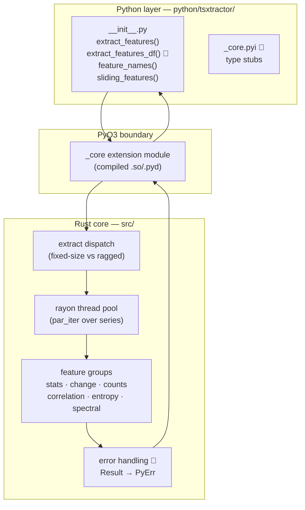
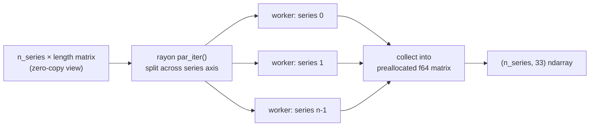
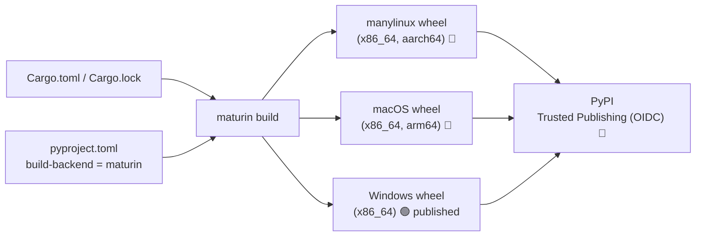
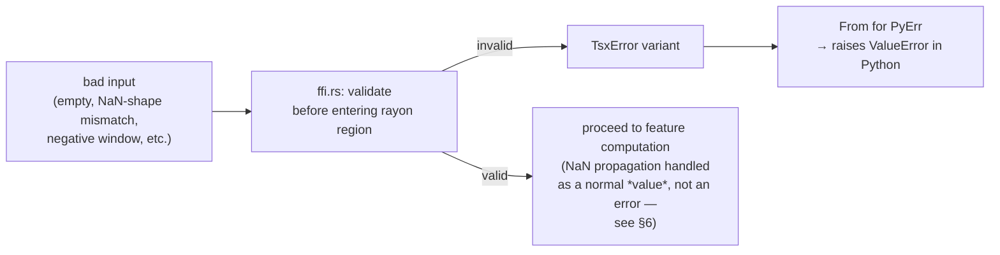
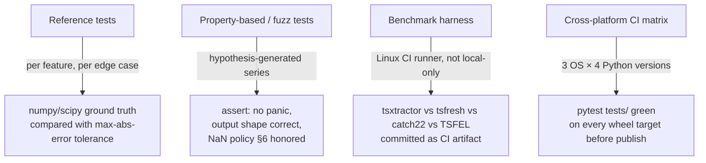

# tsxtractor — Architecture

**Companion to:** `tsxtractor_PRD.md` | **Scope:** system design for v1.0 hardening, not a new design
**Legend:** 🟢 Existing (confirmed from repo) · 🔵 Proposed (needed for v1.0, per PRD)

---

## 1. System Overview

`tsxtractor` is a two-layer system: a thin Python package for ergonomics, and a Rust extension module for the actual numeric work. The only thing that crosses the language boundary is numpy array data (in) and a numpy `f64` matrix (out) — no Python objects, no callbacks, no shared mutable state.



---

## 2. Component Breakdown

### 2.1 Python layer (`python/tsxtractor/`) 🟢 exists, 🔵 needs additions

| File | Role | Status |
|---|---|---|
| `__init__.py` | Public API surface, re-exports from `_core` | 🟢 exists |
| `__init__.py: extract_features_df()` | Wraps `extract_features()` + `feature_names()` into a labeled `pandas.DataFrame` | 🔵 add |
| `_core.pyi` | Type stubs for the compiled extension so IDEs/mypy see real signatures instead of `Any` | 🔵 add |
| `py.typed` | Marker file so type checkers trust the stubs | 🔵 add |
| `__init__.py: __version__` | Sourced from `Cargo.toml`/`pyproject.toml` at build time, exposed to users | 🔵 add |

This layer's job is deliberately small: **no numeric logic lives in Python.** If a future contributor is tempted to add a feature in Python for convenience, that's an architecture violation — it breaks the "one core, one source of truth for math" property that makes correctness testing tractable.

### 2.2 PyO3 boundary (`_core` extension module) 🟢 exists, 🔵 hardening needed

This is the only place Rust and Python code physically touch. Current contract (inferred from the public API and `pyproject.toml`'s `features = ["pyo3/extension-module"]`):

| Python-visible call | Rust-side signature (conceptual) | Input handling |
|---|---|---|
| `extract_features(X: np.ndarray)` | `fn extract_features(x: PyReadonlyArray2<f64>) -> PyResult<Py<PyArray2<f64>>>` | Zero-copy read view of a 2D array (`n_series × length`) |
| `extract_features(list_of_1d_arrays)` | `fn extract_features_ragged(x: Vec<PyReadonlyArray1<f64>>) -> PyResult<Py<PyArray2<f64>>>` | Zero-copy read view per series; output padded to `(n_series, 33)` |
| `sliding_features(x, window, stride)` | `fn sliding_features(x: PyReadonlyArray1<f64>, window: usize, stride: usize) -> PyResult<Py<PyArray2<f64>>>` | Zero-copy 1D view; windows generated internally, not materialized as Python objects |
| `feature_names()` | `fn feature_names() -> Vec<String>` | No array data — pure metadata |

**Boundary contract to enforce (🔵 v1.0 requirement):** no `panic!` may cross this boundary. Every fallible path returns `Result<_, TsxError>`, and a single conversion point maps `TsxError → PyErr` (see §5). This is the #1 architectural fix called out in the PRD's testing section — an uncaught Rust panic currently surfaces to the Python user as an opaque interpreter abort or a low-quality traceback rather than a catchable `ValueError`.

### 2.3 Rust core (`src/`) 🟢 exists — proposed internal module split for maintainability

The repo currently has a `src/` directory (contents not independently verified in this pass); the following is the **target layout** the PRD's Phase 0/1 hardening work should converge on, so that adding feature #34 later — or splitting into a multi-language binding — doesn't require touching a monolithic file:

```
src/
├── lib.rs              # PyO3 module registration only — no math here
├── ffi.rs              # 🔵 the #[pyfunction] wrappers; converts PyReadonlyArray ↔ ndarray,
│                        #    calls into pure-Rust extract logic, maps TsxError → PyErr
├── error.rs             # 🔵 TsxError enum (EmptySeries, NonFinite, InvalidWindow, ...)
├── extract.rs           # dispatch: fixed-size batch vs ragged list vs sliding window
├── pool.rs               # rayon thread pool setup (if custom-sized; else default global pool)
└── features/
    ├── mod.rs            # feature registry — single source of truth for `feature_names()` order
    ├── stats.rs           # mean, std, var, min, max, median, quantiles, skew, kurtosis, abs_energy, rms
    ├── change.rs          # mean_abs_change, mean_change, cid_ce, mean_second_derivative_central
    ├── counts.rs          # zero_crossings, mean_crossings, number_of_peaks, longest_strike_above/below_mean
    ├── correlation.rs     # autocorr lags 1/2/5/10, linear trend slope + r²
    ├── entropy.rs          # permutation_entropy
    └── spectral.rs         # dominant_frequency, spectral_centroid, spectral_entropy
```

**Why `features/mod.rs` is the single registry:** `feature_names()` order is a stability guarantee (PRD §7) — column `i` in the output matrix must always correspond to the same named feature across versions. Centralizing the name↔computation mapping in one file makes that guarantee auditable in one place instead of scattered across six files.

### 2.4 Parallelism layer (`rayon`) 🟢 exists



**Key property to document (PRD §9):** parallelism is across the **series** dimension, not across individual feature computations within one series. This means:
- A single call on one series shows no speedup — expected and should be documented, not treated as a bug report.
- The GIL must be released during the `rayon` compute region (`Python::allow_threads` in PyO3) so multi-core scaling isn't silently capped by the interpreter lock. **Verify this is actually happening** — it's easy to build a correct-looking PyO3 function that never releases the GIL, which would quietly cap throughput to single-core regardless of `rayon`.

### 2.5 Build system 🟢 exists, 🔵 CI needed



This is the architecture's current single point of failure for adoption: the compute engine and API are done, but only one leaf of this build graph (`WHEEL_WIN`) has ever reached PyPI. Section 10 of the PRD covers the CI workflow; this diagram is here so the coding agent implementing it understands *why* each platform leaf matters (Linux = CI/servers/most data scientists, macOS = most individual contributors' laptops).

---

## 3. Data Flow — Three Entry Points

### 3.1 `extract_features(X)` — fixed-size batch
```
np.ndarray (n_series, length), dtype float64
  → PyReadonlyArray2 (zero-copy)
  → rayon par_iter over rows
      → per row: run all 6 feature groups → [f64; 33]
  → assemble (n_series, 33) f64 matrix
  → PyArray2, returned to Python (copy back across boundary — unavoidable for the output)
```

### 3.2 `extract_features(list_of_arrays)` — ragged series
```
list[np.ndarray], each 1D, variable length
  → Vec<PyReadonlyArray1> (zero-copy per element)
  → rayon par_iter over Vec
      → per series: same 6 feature groups → [f64; 33]
  → assemble (n_series, 33) f64 matrix
```
Same feature logic as 3.1 — the only difference is the input shape handling in `extract.rs`'s dispatch, not the math. This should be enforced by both paths calling the same per-series function in `features/mod.rs`, never duplicated.

### 3.3 `sliding_features(x, window, stride)` — rolling windows over one long series
```
np.ndarray (length,), dtype float64
  → PyReadonlyArray1 (zero-copy)
  → generate window index pairs (start, start+window) stepping by stride — indices only, no data copy
  → rayon par_iter over window index pairs
      → per window: slice the original view (still zero-copy) → run 6 feature groups
  → assemble (n_windows, 33) f64 matrix
```
**Edge cases requiring explicit handling (PRD §11 fuzz targets):** `window > length` → should raise `ValueError`, not silently return zero rows or panic on an out-of-bounds slice; `stride == 0` → would infinite-loop window generation if unchecked; negative `window`/`stride` → caught at the `ffi.rs` boundary before ever reaching slice indexing.

---

## 4. Memory & Ownership Model

- **Input:** `PyReadonlyArray{1,2}` from the `numpy` Rust crate gives a borrowed, read-only view into the caller's existing numpy buffer. No copy, no allocation, for the duration of the call. This is the basis of the "zero-copy" claim in the README/PRD and must be preserved — any hardening change (e.g., input validation) should validate shape/dtype/finiteness **without** materializing a full defensive copy of the data.
- **Output:** a new `f64` buffer is allocated once per call, sized exactly `(n_series, 33)` or `(n_windows, 33)`, filled in parallel by the workers, then handed to Python as a `PyArray2` (this allocation is unavoidable — the output doesn't exist yet).
- **No shared mutable state across the FFI boundary.** Each call is fully self-contained; there is no persistent Rust-side object holding state between calls. This keeps the threading story simple (§2.4) and means there's no cleanup/lifecycle management needed on the Python side beyond normal garbage collection of the returned array.

---

## 5. Error Handling Architecture 🔵 (PRD §7, §11 — currently the main correctness gap)



Two categories that must be kept distinct:
1. **Structural errors** (empty input, shape mismatch, invalid window/stride, non-finite values *if* the API decides to reject rather than propagate) → these are `TsxError` → `PyErr`, raised as Python exceptions, validated **before** entering the parallel region so a bad row doesn't waste a worker thread or trigger a panic mid-computation.
2. **NaN-as-value** (a series legitimately contains NaN, or a feature is mathematically undefined for a given series, e.g. autocorrelation of a constant series) → this is **not an error**, it's the documented output contract (§6). Conflating these two categories is the most likely source of a confusing v1.0 bug, so the validation layer and the NaN-propagation logic should not share code paths.

---

## 6. NaN Propagation Model 🟢 documented in README, 🔵 needs dedicated test coverage

| Input condition | Output behavior |
|---|---|
| Series contains any NaN | **All 33 features for that series** are NaN — no partial/silent imputation |
| Feature mathematically undefined for an otherwise-valid series (e.g. autocorrelation of a constant series, spectral features of a constant series, change features of a length-1 series) | **That individual feature** is NaN; other features for the same series compute normally |
| Empty series (length 0) | Structural error (§5), not a NaN row |

This table is the contract the Phase 0 test suite (PRD §11) needs to lock down with one test per row, per feature group, so a future refactor can't silently change propagation behavior without a red test.

---

## 7. Extension Points — "How do I add feature #34?"

For contributors (this doubles as the architecture-level answer to `CONTRIBUTING.md`, PRD §13):

1. Implement the computation in the relevant `features/*.rs` file (or a new file if it's a new group).
2. Register it in `features/mod.rs`'s single feature registry — this is what `feature_names()` reads from, so the name and column position are defined in exactly one place.
3. Add a reference test comparing against a `numpy`/`scipy` equivalent, across the standard edge-case matrix (normal, constant, single-element, NaN-containing, empty) per §11 of the PRD.
4. Bump the **major version** if this changes `feature_names()` output length or order (per the stability guarantee in PRD §7) — adding a feature at the end of the existing 33 is additive and could be a minor version; reordering existing columns never is.
5. No Python-layer changes needed unless the new feature requires a new parameter shape (e.g., something window-based like `sliding_features` needed) — the Python wrapper is a pass-through by design (§2.1).

---

## 8. Testing Architecture (maps to PRD §11)



The architectural point: reference tests and fuzz tests both exercise the same `features/*.rs` code, but from different angles — reference tests prove *correctness* on known inputs, fuzz tests prove *robustness* (no panics) on adversarial inputs. Both are needed; neither substitutes for the other.

---

## 9. Versioning & Compatibility Contract

| Surface | Stability guarantee | Breaking-change trigger |
|---|---|---|
| `feature_names()` order/length | Stable within a major version | Reordering, removing, or renaming a feature |
| `extract_features()` output dtype (`float64`) | Stable | Changing to `float32` or similar |
| `extract_features_df()` column names | Mirrors `feature_names()` | Same as above |
| NaN propagation rules (§6) | Stable | Changing which conditions produce row-NaN vs feature-NaN |
| Minimum supported Python / platform matrix | Documented per release, may narrow only at a major version | Dropping a Python version or platform |

This table is what `CONTRIBUTING.md` (PRD §13) should point to whenever a PR's impact on versioning is unclear.

---

## 10. Explicitly Out of Scope for This Architecture (see PRD §5, §15)

- No GPU compute path — the `rayon` CPU model is the whole story for v1.0.
- No persistent/stateful server component — this is a stateless library, not a service.
- No R/Julia/MATLAB bindings — would require a separate binding crate reusing the same `features/` core, but that's a v2.0-or-later decision gated on demand, not upfront work.
- No plugin system for user-defined features — the registry in `features/mod.rs` is intentionally closed/curated (this is the product's differentiation per PRD §3, not a limitation to engineer around).