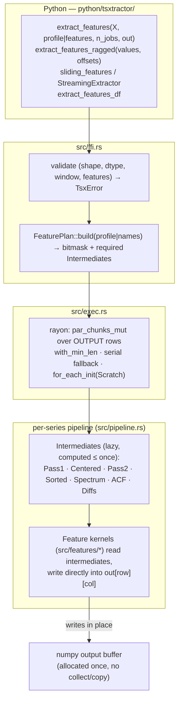
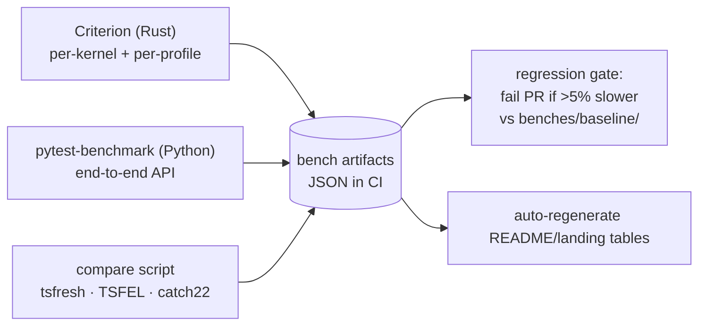

# Tsxtract — Max-Throughput Architecture (`arch_max.md`)

**Extends:** `arch.md` (v1.0 hardening). Everything in `arch.md` §5 (error model), §6 (NaN model), §9 (versioning) still holds.
**Goal:** the highest possible throughput *and* the widest useful feature output, without ever breaking the `core33` contract.
**Audience:** Claude Code. Execute phase by phase (§9). Do not skip gates.

---

## 0. Claude Code Protocol

1. **Phase 0 first.** `src/` was not audited when this file was written. Read every file in `src/`, `python/tsxtractor/`, `benches/`, `Cargo.toml`, `pyproject.toml`. Where this file and the code disagree, the code is truth for *current behavior*, this file is truth for *target design*. Record disagreements in `docs/arch_audit.md`.
2. Never merge a change that fails its phase gate (§9).
3. Every optimization needs: a Criterion benchmark before/after, a correctness test proving identical output (tolerances in §8.2), and a line in `CHANGELOG.md`.
4. No numeric logic in Python. No `panic!` across FFI. No input copies in the hot path.

**Kickoff prompt (paste into Claude Code):**
```
Read arch_max.md fully. Execute Phase 0 only: audit the repo, produce docs/arch_audit.md,
capture Criterion + pytest-benchmark baselines into benches/baseline/, and flamegraph the
core33 path for n_series=1000,len=500 and n_series=1,len=100000. Stop at the Phase 0 gate
and report numbers. Do not change library code in Phase 0.
```

---

## 1. Baseline & Honest Normalization

Source: README benchmark, 16 cores, 1,000 series × 500 steps.

| Library | Features | Runtime | µs / series-feature | Raw speedup claimed | **Per-feature speedup** |
|---|---|---|---|---|---|
| Tsxtract core33 | 33 | 1.25 ms | 0.038 | — | — |
| catch22 | 22 | 1,024.8 ms | 46.58 | 820× | **~1,230×** |
| TSFEL | 156 | 7,154.0 ms | 45.86 | 5,725× | **~1,210×** |
| tsfresh | 777 | 17,683.3 ms | 22.76 | 14,151× | **~600×** |

**Why this matters:** the 14,151× headline compares 33 features against 777. A skeptic will normalize it. Publish *both* the raw and per-feature numbers, and (after Phase 4) a **matched-feature** benchmark where Tsxtract computes the same feature list as the competitor. That is the number that survives scrutiny, and with the extended catalog it should still be enormous.

**Strategy = two levers:**
- **Lever A — Speed ceiling:** make core33 as fast as the hardware allows (Phases 1–2).
- **Lever B — Output ceiling:** scale the *catalog* to tsfresh-level breadth (hundreds of features) while keeping cost per feature near-flat via shared intermediates (Phases 3–4). Breadth at 0.04–0.5 µs/feature is the moat; 33 features alone is the weakness in head-to-head comparisons.

---

## 2. Invariants (never break)

| # | Invariant | Enforced by |
|---|---|---|
| I1 | `profile="core33"` is the default; column order/length from `feature_names()` frozen for 1.x | golden file `tests/golden/core33_names.json` |
| I2 | Series with any NaN → all-NaN row. Undefined single feature → that feature NaN. Empty series → `ValueError` | `tests/test_nan_contract.py` |
| I3 | Input is borrowed, never defensively copied (contiguous f64/f32). Non-contiguous input: one explicit copy, documented | allocation-counting test |
| I4 | No panic crosses FFI; `TsxError → PyErr` single conversion point; `catch_unwind` at boundary as backstop | fuzz tests |
| I5 | GIL released for the whole parallel region | test: 2 Python threads each calling `extract_features` scale ≈ 2× |
| I6 | Output dtype float64 | stub + test |
| I7 | `unsafe` only inside `src/kernels/`, each block with `// SAFETY:` and a `debug_assert!` | `#![deny(unsafe_code)]` everywhere else |

---

## 3. Performance Model (n = 500, f64, one core)

Estimates to **validate in Phase 0**, not promises. Use them as stage budgets; any stage 2× over budget is a bug to profile.

| Stage | What | Budget / series | Dominant cost |
|---|---|---|---|
| P1 | fused pass 1: sum, min, max, Σx², Σ\|Δx\|, ΣΔx, zero-crossings | 0.1–0.2 µs | memory/SIMD |
| P2 | centered buffer + fused pass 2: m2, m3, m4, mean-crossings, peaks | 0.2–0.4 µs | SIMD |
| ACF | lags 1,2,3,5,10 as dot products on centered buffer | 0.2–0.4 µs | SIMD FMA |
| SORT | sorted copy → q05,q25,q50,q75,q95, IQR, MAD | 2–5 µs | sort/select |
| FFT | real FFT (mean-removed) + power spectrum + 6 spectral stats | 2–4 µs | FFT |
| PERM | permutation entropy (order 3, delay 1) | 0.3–0.8 µs | branchless LUT |
| **Total** | | **~6–11 µs** | |

Reference point: 1.25 ms × 16 cores / 1,000 series ≈ 20 µs core-time/series today (if scaling were perfect). **Target: ≤ 10 µs/series single-core for core33 at n=500.** SORT and FFT should be >70% of the time; if they are not, something upstream is wasteful.

---

## 4. Target Architecture



### 4.1 Target repo layout

```
src/
├── lib.rs                # PyO3 registration only
├── ffi.rs                # pyfunctions, validation, GIL release, TsxError→PyErr
├── error.rs
├── plan.rs               # FeaturePlan: names → bitmask → required intermediates
├── exec.rs               # rayon scheduling, serial fallback, window/ragged dispatch
├── pipeline.rs           # per-series: ensure intermediates → run selected kernels
├── scratch.rs            # per-thread reusable buffers + FFT plan cache
├── intermediates.rs      # Pass1, Pass2, Sorted, Spectrum, Acf, Diffs
├── registry.rs           # static FEATURES: &[FeatureDef]  (single source of truth)
├── kernels/              # the only place `unsafe`/SIMD is allowed
│   ├── mod.rs            # runtime dispatch (AVX2+FMA / AVX-512 / NEON / scalar)
│   ├── reduce.rs         # fused passes, dots
│   ├── sort.rs           # radix / nested-select quantiles
│   ├── fft.rs            # realfft wrappers, plan cache
│   └── perm.rs           # permutation-entropy LUT kernels
├── features/             # one file per family; pure functions of intermediates
│   ├── core33.rs  stats.rs  change.rs  counts.rs  acf.rs  trend.rs
│   ├── spectral.rs  entropy.rs  complexity.rs  catch22.rs
└── streaming.rs          # incremental state, sliding fast paths
```

### 4.2 Feature registry + intermediate DAG (the core scaling mechanism)

Why tsfresh is slow: every feature re-derives its inputs. Why Tsxtract can hold ~0.04–0.5 µs/feature at hundreds of features: **every shared intermediate is computed at most once per series**, and unrequested features cost nothing.

```rust
bitflags::bitflags! {
    pub struct Needs: u16 {
        const PASS1    = 1 << 0;  // sum,min,max,sumsq,abs_diff...
        const CENTERED = 1 << 1;  // x - mean, in scratch
        const PASS2    = 1 << 2;  // m2,m3,m4, crossings, peaks
        const SORTED   = 1 << 3;  // sorted copy
        const SPECTRUM = 1 << 4;  // |FFT|² (mean-removed)
        const ACF      = 1 << 5;  // autocovariances up to max requested lag
        const DIFFS    = 1 << 6;  // first differences
    }
}

pub struct FeatureDef {
    pub name: &'static str,          // canonical, e.g. "autocorr_lag_5"
    pub aliases: &'static [&'static str], // "tsfresh__autocorrelation__lag_5", ...
    pub needs: Needs,
    pub cost: CostClass,             // A fused | B sorted | C spectral | D acf | E heavy
    pub profiles: ProfileMask,       // core33, extended, full, catch22, minimal
    pub compute: fn(&Series, &Intermediates) -> f64,
}
pub static FEATURES: &[FeatureDef] = &[ /* append-only; core33 first, in frozen order */ ];
```

Rules:
- `core33` occupies indices 0..33 in frozen order. New features are **append-only** (additive → minor version).
- `FeaturePlan::build` ORs the `needs` of selected features → `Intermediates::ensure(needs)` runs only what's required. A `minimal` profile never touches SORT or FFT.
- Kernels never allocate. They read slices out of `Scratch` and return `f64`.

### 4.3 Scratch (per-thread, allocation-free steady state)

```rust
pub struct Scratch {
    pub centered: Vec<f64>,     // len = max_len
    pub sorted:   Vec<f64>,
    pub diffs:    Vec<f64>,
    pub fft_in:   Vec<f64>,
    pub fft_out:  Vec<Complex<f64>>,
    pub fft_tmp:  Vec<Complex<f64>>,
    pub power:    Vec<f64>,
    pub acf:      Vec<f64>,
    pub fft_plans: HashMap<usize, Arc<dyn RealToComplex<f64>>>, // per-length cache
}
```
Created once per worker via `for_each_init` / `map_init`. Grow-only; never shrink inside a call. Plans: one global `RealFftPlanner` behind `Mutex` only for *plan creation*; hot path reads cached `Arc` from the thread-local map.

### 4.4 Executor & output

- **Write in place.** Allocate output once (`PyArray2::zeros`/uninit), take `as_slice_mut`, then:
  ```rust
  out.par_chunks_mut(n_cols)
     .with_min_len(MIN_ROWS_PER_TASK)          // tune: 8–64, benchmark
     .zip(rows)                                 // or index-based
     .for_each_init(|| Scratch::new(max_len), |scratch, (row_out, x)| {
         pipeline::run(x, &plan, scratch, row_out);
     });
  ```
  No `Vec<[f64;33]>` + collect + copy.
- **GIL:** wrap the whole region in `py.allow_threads(...)` (named `detach` in newer PyO3 — use whichever the pinned version provides). Inputs must be converted to plain `&[f64]` *before* releasing the GIL.
- **Serial fallback:** `n_series < SERIAL_THRESHOLD` (start at 8, tune) → no rayon (pool wake-up costs more than the work).
- **Single very long series (len ≳ 1e6):** optional intra-series parallelism for Pass1/Pass2 via chunked map-reduce with Chan/Pébay moment merging. Behind a flag, benchmark-gated.
- **Thread control:** `n_jobs` param builds/reuses a dedicated `rayon::ThreadPool` (cached by size). Document interaction with numpy/BLAS threads (oversubscription).
- **NaN fast path:** Pass 1 computes `sum`. If `!sum.is_finite()`, run the exact slow check (NaN vs ±inf) to preserve I2 semantics; otherwise zero extra cost on the happy path. If NaN is confirmed → fill row with NaN and return before any other work.

### 4.5 Kernel designs

**Fused passes (`kernels/reduce.rs`)**
- Pass 1 (one read of `x`): 4–8 independent accumulators (`wide::f64x4` or `std::simd` if stable, else `core::arch` behind runtime dispatch): sum, min, max, Σx², Σ|Δx|, ΣΔx, sign-change count for zero-crossings.
- Between passes: `centered[i] = x[i] - mean` written to scratch (reused by ACF and FFT input).
- Pass 2 (one read of `centered`): m2, m3, m4 via `d2 = d*d; m3 += d2*d; m4 += d2*d2`; mean-crossings; local peaks. Two-pass centered moments (not naive power sums) for numerical stability.
- Lag dots: ACF lags are `dot(centered[..n-k], centered[k..])`: 5 lag-dots for core33. Direct dots up to ~16 lags; FFT-based (`IFFT(|X|²)` on a 2n-padded transform) beyond that.

**Quantiles / order stats (`kernels/sort.rs`)** — one sorted scratch copy per series serves q05, q25, median, q75, q95, IQR, MAD base, deciles, first/last-location helpers. Implement and benchmark **three** strategies, keep the winner per length bucket:
1. `sort_unstable_by(f64::total_cmp)` (baseline)
2. LSD radix sort on order-preserving u64 keys (usually wins for n ≳ 256)
3. Nested `select_nth_unstable`: median first, then q25/q75 inside the partitions, then q05/q95 (wins when few quantiles and large n)
MAD needs a second selection on `|x − median|`; reuse the `diffs` scratch.

**Spectral (`kernels/fft.rs`)** — one real FFT per series on the mean-removed buffer; one power spectrum `|X_k|²`; *all* spectral features (energy via Parseval cross-check, dominant freq, centroid, spread, roll-off, spectral entropy, band powers) read the same `power` slice. Do **not** zero-pad by default (changes values vs v1.0); expose `fft_mode="exact"|"fast"` where `"fast"` pads to the next 5-smooth length and is opt-in, documented as non-identical.

**Permutation entropy (`kernels/perm.rs`)** — order 3/delay 1: compute 3 comparison bits per window → 3-bit index → `[u8; 8]` LUT → increment one of 6 `u32` counters. Branchless. Entropy from counters via precomputed `n·ln(n)` table (or direct `ln` on 6 values — negligible). Orders 4–6 / delays 1–3: Lehmer-code LUT or rank-sort with small fixed arrays; counters in stack arrays sized `order!`.

**Crossings / peaks / strikes** — fold into Pass 2 where possible; longest-strike features are a single branch-light scan over the sign of `centered`.

### 4.6 SIMD dispatch & build

- Wheels must run on baseline CPUs → **no `-C target-cpu=native`** in CI wheels. Use runtime dispatch (`multiversion` crate, `pulp`, or manual `is_x86_feature_detected!` / `std::arch`) in `kernels/mod.rs` with variants: scalar, AVX2+FMA, AVX-512 (opt-in/benchmarked; may downclock), aarch64 NEON.
- Bit-exactness: SIMD and scalar paths must agree within §8.2 tolerances (different summation order ⇒ not bit-identical; test accordingly).
- `Cargo.toml` release profile:
  ```toml
  [profile.release]
  opt-level = 3
  lto = "fat"
  codegen-units = 1
  debug = "line-tables-only"   # keeps flamegraphs symbolized
  # panic = "unwind"  (KEEP: catch_unwind at FFI; do not use abort)
  ```
- Optional Phase-2 stretch: PGO via `cargo-pgo` in the release workflow (typically a few-to-low-teens % on branchy code like peaks/perm-entropy); commit the profile-generation script, not the profile data.
- Dev-only: `RUSTFLAGS="-C target-cpu=native"` bench profile for the "ceiling" number; never ship it.

### 4.7 Input handling (cheap wins that are easy to miss)

| Case | Behavior |
|---|---|
| C-contiguous f64 2D | zero-copy slice rows |
| C-contiguous **f32** | native f32 read, accumulate in f64 (no Python-side `astype` copy, half the memory bandwidth). Generic kernels over `T: Float` via a thin load trait |
| Fortran-order / strided | one explicit contiguous copy, `warnings.warn`ed once with the cost |
| int dtypes | convert per-row into scratch (no full-matrix copy) |
| list of 1D arrays | works, but each element costs PyO3 extraction overhead (~µs). Document as the slow ragged path |
| **CSR ragged API** | `extract_features_ragged(values: 1D, offsets: 1D[int64])` → zero per-element Python overhead; the fast path for 100k+ variable-length series |
| `out=` param | caller-supplied preallocated `(n, n_cols)` float64 buffer → zero allocation across repeated calls (streaming-batch workloads) |

### 4.8 `sliding_features` & `StreamingExtractor`

**Sliding windows** (overlap = `1 − stride/window`):
- Parallelize over **contiguous blocks of windows**, not individual windows, so each worker can keep incremental state across consecutive windows.
- Strategy selector (benchmark-tuned): if `stride ≥ window/8` → recompute each window with the normal fused pipeline (incremental bookkeeping costs more than it saves). If `stride ≪ window` → incremental:
  - moments/RMS/energy/mean-abs-change/crossings: prefix sums over globally-centered data with Neumaier compensation, or per-block re-centering to bound cancellation; verify against direct recompute.
  - quantiles: maintain a sorted window (binary-search insert/remove, small `memmove`) instead of re-sorting.
  - spectral: recompute FFT per window (sliding DFT only if ≤ ~8 bins requested).
- Be honest in docs: SORT and FFT dominate, so incremental moments alone barely move the needle for `core33`; the gain is for moment-heavy profiles and small strides.

**Streaming** — split features by update cost and expose it in the API:
- **O(1) per push (true streaming):** mean, var, skew, kurt (Welford/Pébay with removal for a fixed-capacity ring buffer), min/max (monotonic deque), RMS/energy, mean-abs-change, zero/mean-crossing rates, lag-k autocorrelation via running lagged cross-sums.
- **O(n) on `compute()` (cached, dirty-flag):** quantiles, MAD, spectral, permutation entropy.
- `compute(kind="fast"|"all")`; `"fast"` returns only the O(1) subset. **Do not market `compute()` as O(1) for all 33 features** — fix README wording to match.

---

## 5. Feature Catalog & Profiles

| Profile | Size | Contents | Intended cost |
|---|---|---|---|
| `minimal` | ~10–12 | moments, min/max, RMS, ZCR (cost class A only) | ≲ 0.5 µs/series |
| **`core33`** (default) | 33 | frozen v1.0 set | ≲ 10 µs/series |
| `extended` | ~120–200 | core33 + families below, cost classes A–D | single-digit µs per 10 features amortized |
| `full` | match benchmark's 777 list | extended + remaining tsfresh-parity families | still ≫ 100× faster than tsfresh |
| `catch22` | 22 | catch22-compatible set (exact definitions) | beats catch22 by ≫ 100× |

**Exact `full` list:** do not guess. Generate `tests/fixtures/tsfresh_777_names.json` from the repo's benchmark script (the tsfresh settings used for the 777 count), then maintain `docs/parity_matrix.md` mapping every name → implemented / planned / skipped (with reason). Names use tsfresh's `feature__param_value` convention as aliases so users can swap libraries.

**Families to add (build in cost-class order):**

| Family | Examples | Cost class | Shares |
|---|---|---|---|
| Distribution+ | sum, abs_sum, deciles q10..q90, count_above/below_mean, ratio_beyond_r_sigma(r grid), large_standard_deviation(r grid), variance_larger_than_std, has_duplicate(_max/_min), ratio_unique_values, sum/percentage_of_reoccurring_values, first/last_location_of_min/max | A / B | Pass1, Sorted |
| Change | cid_ce (raw+normalized), absolute_sum_of_changes, mean_second_derivative_central, change_quantiles grid | A / B | Diffs, Sorted |
| Counts/strikes | number_crossing_m (m∈{-1,0,1}), number_peaks (n∈{1,3,5,10,50}), longest_strike_above/below_mean | A | Centered |
| Time-reversal/nonlinear | c3 (lag 1..3), time_reversal_asymmetry_statistic (lag 1..3) | A | Centered |
| ACF family | autocorrelation lags 0..N, partial autocorrelation (Levinson–Durbin from ACF), agg_autocorrelation, ar_coefficient (Yule–Walker from ACF) | D | ACF |
| Trend | linear_trend (slope, intercept, r, stderr), agg_linear_trend (chunk × agg grid) | A | Pass1 + index sums |
| Spectral | fft_coefficient (real/imag/abs/angle × k=0..K), fft_aggregated (centroid/var/skew/kurt), welch density, band powers, spectral entropy/flatness | C | Spectrum |
| Entropy/complexity | permutation entropy (orders 3–6 × delays 1–3), binned_entropy, lempel_ziv, benford_correlation | B / A | Sorted/Centered |
| Heavy (gate behind `full`, opt-in per feature) | sample_entropy, approximate_entropy, cwt_coefficients, DFA/Hurst | E (O(n·m) or O(n²)) | — |

Implementation rule per feature: (1) reference implementation in test using the *named* library where one exists (tsfresh/TSFEL/catch22), else scipy/numpy; (2) edge-case matrix: normal, constant, length-1, length-2, NaN-containing, inf-containing, very long, near-constant with large offset (cancellation); (3) NaN semantics per I2.

**Cost class E guard:** heavy features must never run unless explicitly selected; `full` includes them only when `include_heavy=True`. Document runtime impact next to each.

---

## 6. Python API (additive; v1 calls unchanged)

```python
tsx.extract_features(X, *, profile="core33", features=None, n_jobs=None, out=None, fft_mode="exact")
tsx.extract_features_ragged(values, offsets, *, profile="core33", features=None, n_jobs=None)
tsx.extract_features_df(X, **same)          # labeled; columns == feature_names(profile/features)
tsx.feature_names(profile="core33", features=None)
tsx.list_profiles() -> dict[str, int]
tsx.describe_feature(name) -> dict          # cost class, needs, definition, aliases
tsx.sliding_features(x, window, stride, *, profile="core33", features=None, n_jobs=None)
tsx.StreamingExtractor(capacity, *, features=None).push(v) / .compute(kind="fast")
```
`features` accepts canonical names or tsfresh-style aliases; unknown name → `ValueError` listing close matches. Ship `_core.pyi` + `py.typed` with exact signatures. Optional Polars/Arrow zero-copy input (Arrow C Data Interface) as a stretch after Phase 4.

---

## 7. Benchmark Architecture



**Matrix (all reported):**
- Shapes: (n_series, len) ∈ {(1, 1e5), (100, 100), (1k, 500), (10k, 500), (100k, 500), (1k, 5k), (100, 50k)}
- Threads: {1, 2, 4, 8, 16, all}
- Profiles: minimal, core33, extended, full (+heavy off)
- Libraries: Tsxtract vs tsfresh, TSFEL, catch22 — **three views per row:** raw runtime, µs per series-feature, matched-feature runtime
- Memory: peak RSS delta (`tracemalloc` + RSS sampling) for 100k × 500
- Single-core numbers and scaling efficiency (speedup_N / N) — a library that is fast only because it uses 16 cores should say so

**Rules:** pin versions of competitors in `benches/requirements.txt`; run on a stated Linux CI runner and commit the machine spec; warm up; report median + IQR; never compare different feature definitions silently (matched-feature runs use each competitor's own implementation of the same definition).

---

## 8. Correctness Architecture

### 8.1 Layers
1. **Reference tests** per feature vs numpy/scipy/tsfresh/TSFEL/catch22.
2. **Kernel parity:** SIMD vs scalar on random + adversarial data.
3. **Property tests (hypothesis):** no panic, correct shape, NaN contract, permutation-invariance where mathematically expected (e.g., quantiles of shuffled data), shift/scale equivariance (mean shifts, std scales).
4. **Fuzz (cargo-fuzz):** kernels and FFI entry points with arbitrary shapes/windows/strides/feature lists.
5. **Golden files:** `core33` output on fixed seeds — any diff fails CI unless deliberately regenerated with a version bump.
6. **Cross-platform:** 3 OS × supported Python versions, every wheel target, before publish.

### 8.2 Tolerances
- Moments/ACF/quantiles vs numpy: rel err ≤ 1e-12 (f64), ≤ 1e-5 (f32 input).
- Spectral/entropy vs scipy/numpy: rel err ≤ 1e-9.
- SIMD vs scalar: rel err ≤ 1e-12; compare with `abs_diff <= atol + rtol*|ref|`.
- Cancellation test: series `1e9 + N(0,1)` — variance must stay within 1e-6 relative of the exact value.

---

## 9. Phased Roadmap & Gates

### Phase 0 — Audit & Baseline (no library changes)
- Tasks: audit `src/`; write `docs/arch_audit.md` (current feature list/order vs README vs `arch.md` — they list different feature names; resolve which is real); Criterion + pytest-benchmark baselines to `benches/baseline/`; `perf`/`samply`/`cargo flamegraph` on both shapes; verify GIL release (I5) and zero-copy (I3) with tests; count allocations per call.
- **Gate:** baseline numbers + flamegraph committed; per-stage time table (compare to §3 budgets); list of top-5 hotspots.

### Phase 1 — Core33 hot-path rewrite
- Tasks: `Scratch` + `for_each_init`; in-place output via `par_chunks_mut`; fused Pass1/Pass2 with centered buffer; shared sorted scratch for all order stats; single spectrum for all spectral features; branchless perm-entropy LUT; direct lag dots; NaN fast path; serial fallback; `with_min_len` tuning; release profile (§4.6).
- **Gate:** golden file unchanged (within §8.2); all I1–I7 tests green; core33 single-core ≤ 1.5× the §3 total budget; ≥ 1.5× end-to-end speedup on (1k, 500) vs baseline **or** a written profile explaining the physical limit.

### Phase 2 — SIMD, dispatch, input fast paths
- Tasks: `kernels/` with runtime dispatch; f32 native path; CSR ragged API; `out=`; quantile strategy bake-off (§4.5) with per-length winner table; optional PGO job.
- **Gate:** SIMD/scalar parity tests green; Criterion shows each kernel ≥ 1.5× its scalar self where vectorizable (else documented why not); wheels still import on a baseline x86-64 CPU (CI test on an old-CPU emulation/qemu or `-C target-cpu=x86-64` job).

### Phase 3 — Registry, plan, intermediates (enables breadth)
- Tasks: `registry.rs`, `plan.rs`, `intermediates.rs`; refactor core33 onto them with **zero behavior change**; `features=`/`profile=` API; `list_profiles`, `describe_feature`; `.pyi` updates.
- **Gate:** golden unchanged; `profile="minimal"` measurably faster than `core33` and never allocates SORT/FFT scratch (test via instrumentation counter); adding a trivial dummy feature requires touching only one `features/*.rs` file + one registry line.

### Phase 4 — Catalog expansion (`extended` → `full`)
- Tasks: generate the 777-name fixture and `parity_matrix.md`; implement families in §5 cost-class order A→D, then C, then E (gated); alias mapping; per-feature reference tests.
- **Gate:** every implemented feature has reference + edge-case tests; `extended` runtime within 2× of the sum of its shared-intermediate costs (no accidental recomputation — assert via counters); matched-feature benchmark vs tsfresh published.

### Phase 5 — Sliding & streaming fast paths
- Tasks: block-parallel windows; strategy selector; sorted-window quantiles; prefix-sum moments with stability guard; streaming O(1) tier + `compute(kind="fast")`; README wording fix.
- **Gate:** incremental == recompute within §8.2 on 1e6-point random-walk and `1e9 + noise` series; benchmark shows crossover point (document `stride/window` threshold).

### Phase 6 — Benchmarks, CI gate, docs, launch claims
- Tasks: full §7 matrix automated; regression gate; regenerate README/landing numbers from artifacts; update `docs/` and `PRD.md` claims; CHANGELOG; version bump (minor: additive).
- **Gate:** every number on README/landing traceable to a CI artifact; claims checklist (§11) all ticked.

### Phase 7 — Stretch (only after 0–6 are green)
- `catch22` exact-parity profile; Arrow/Polars zero-copy input; optional intra-series parallelism for very long series; `float32` output option; `aarch64` PGO.

---

## 10. Risk Register

| Risk | Mitigation |
|---|---|
| Summation-order changes shift outputs in the last digits | Tolerance-based golden tests; document "results equal to 1e-12, not bit-identical across CPUs" |
| Prefix-sum variance cancellation in sliding windows | Centered/compensated sums + stability guard that falls back to direct recompute |
| AVX-512 downclocking hurts mixed workloads | Opt-in; benchmark end-to-end, not kernel-only |
| Rayon + numpy/BLAS thread oversubscription | `n_jobs`, docs, avoid nested parallelism inside kernels |
| Feature-definition mismatch with tsfresh/catch22 makes "parity" claims false | Reference tests *against the named library*; list any deliberate deviations in `parity_matrix.md` |
| `unsafe` bugs | Confined to `kernels/`; fuzz + `cargo miri` on scalar paths; `debug_assert!` bounds |
| FFT of awkward lengths (large prime) slow | Benchmark prime/odd lengths; expose `fft_mode="fast"` (documented non-identical) |
| Denormals slow SIMD | Benchmark on tiny-magnitude data; consider FTZ/DAZ only if measured and documented |
| Heavy features (E) wreck "fast" reputation | Opt-in only; runtime cost documented per feature |
| Marketing claims outrun evidence | §11 checklist; numbers generated from CI artifacts only |

---

## 11. Definition of Done / Launch Claims Checklist

- [ ] core33 ≤ 10 µs/series single-core at n=500 (or documented physical limit with profile)
- [ ] Scaling efficiency reported for 1→16 threads
- [ ] `extended` and `full` profiles shipped, with `parity_matrix.md` against the 777-feature list
- [ ] Matched-feature benchmark vs tsfresh, TSFEL, catch22 published next to raw and per-feature numbers
- [ ] Memory: output-only allocation verified for 100k × 500 (≈ 26.4 MB for core33)
- [ ] GIL release, zero-copy, no-panic invariants tested in CI
- [ ] Streaming docs distinguish O(1) vs O(n) features
- [ ] All wheel targets (Linux x86_64/aarch64, macOS arm64/x86_64, Windows x64) pass tests before publish
- [ ] README / landing / docs tables regenerated from CI artifacts

---

## 12. Per-Phase Kickoff Prompts

```
Phase 1: Read arch_max.md §2,§3,§4.2–4.6 and docs/arch_audit.md. Implement Phase 1 only.
Commit per optimization with before/after Criterion numbers in the message. Stop at the
Phase 1 gate and report: golden-file status, I1–I7 test status, speedup table.
```
```
Phase 3: Implement registry.rs/plan.rs/intermediates.rs per arch_max.md §4.2 and refactor
core33 onto them with zero output change (golden test). Add profile=/features= API and
.pyi updates. Stop at the Phase 3 gate.
```
```
Phase 4: Generate tests/fixtures/tsfresh_777_names.json from benches/ scripts, build
docs/parity_matrix.md, then implement families in §5 cost-class order with reference tests
against the named libraries. Report implemented/planned/skipped counts at the gate.
```
