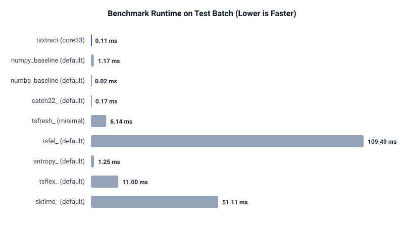

# Tsxtract Performance Benchmark Report

**Date:** 2026-10-04_Aamod  
**Machine:** 13th Gen Intel(R) Core(TM) i7-13620H (16 cores)  
**OS:** Windows-11-10.0.26300-SP0  
**Tsxtract Commit:** `f6b670c4`  

---

## Summary Results Table

| Library | Profile / Set | Series × Len | Median (ms) | Best-of (ms) | Peak RSS (MB) | Status |
|---|---|---|---|---|---|---|
| tsxtract | core33 | 2 × 32 | 0.11 | 0.09 | 0.55 | ok |
| numpy_baseline | default | 2 × 32 | 1.17 | 0.93 | 0.21 | ok |
| numba_baseline | default | 2 × 32 | 0.02 | 0.02 | 0.00 | ok |
| catch22_ | default | 2 × 32 | 0.17 | 0.14 | 0.07 | ok |
| tsfresh_ | minimal | 2 × 32 | 6.14 | 4.11 | 1.96 | ok |
| tsfel_ | default | 2 × 32 | 109.49 | 109.49 | 2.77 | ok |
| antropy_ | default | 2 × 32 | 1.25 | 1.00 | 0.64 | ok |
| tsflex_ | default | 2 × 32 | 11.00 | 10.20 | 49.82 | ok |
| sktime_ | default | 2 × 32 | 51.11 | 48.68 | 67.18 | ok |
| tsxtract_jax | default | 2 × 32 | N/A | N/A | 0.00 | error |

---

## Visual Comparison

---
*Report generated automatically by Tsxtract Benchmark Harness.*