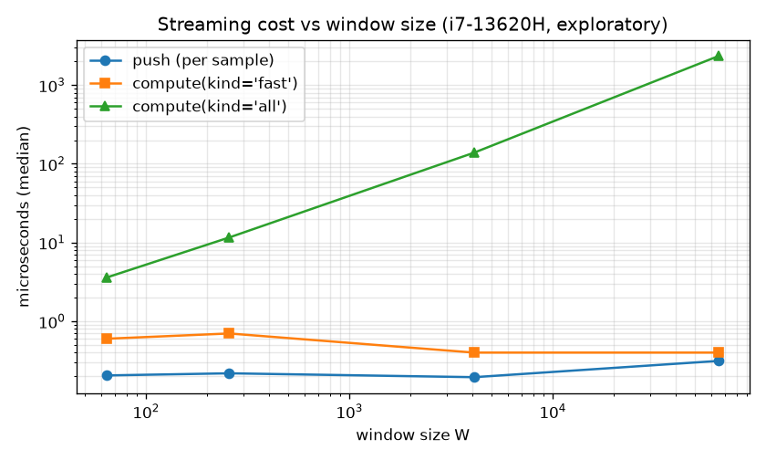

# Streaming guide

`kymora.StreamingExtractor` maintains a rolling window of `window_size`
samples for one live series. `push(value)` ingests one sample;
`compute(kind="fast" | "all")` reads features out of the current window.

## Complexity contract

| Operation | Cost | Notes |
|---|---|---|
| `push` | O(1) amortized | All accumulators update in place. An exact O(W) re-anchor pass fires at most every `min(anchor_interval, ~6% of W)` pushes (see below). |
| `compute(kind="fast")`, all 12 features | O(1) | Pure accumulator reads: no window scan, no allocation, no sorting, no FFT. |
| `compute(kind="fast")` on a window containing ±inf | O(W), exact | Rare degenerate path: runs the batch pipeline on the materialized window so output matches batch by construction. |
| `compute(kind="all")`, all 33 features | O(W)-plus | The exact batch pipeline on the current window (quantiles, spectral, entropy need the full window). |

Per-feature tier for `compute(kind="fast")`:

| Feature | Tier | How |
|---|---|---|
| `mean`, `std`, `var`, `skewness`, `kurtosis` | O(1) | Anchored shifted power sums + binomial expansion (see below) |
| `abs_energy`, `root_mean_square` | O(1) | Exact expansion of the anchored sums |
| `mean_abs_change`, `mean_change`, `cid_ce` | O(1) | Running successive-difference accumulators |
| `zero_crossings` | O(1) | Exact running counter (batch `>`-on-both-sides convention) |
| `trend_slope` | O(1) | Anchor-relative trend accumulator (no offset cancellation) |
| quantiles, spectral, entropy, autocorrelations, peaks, strikes | O(W), `kind="all"` only | Need the full ordered window or its spectrum |

`MultiStreamExtractor.push_many` updates every stream's O(1) tier (mean, std,
var, energy, RMS, crossings from raw running sums) in one lane-parallel pass.
Note: the fleet tier uses raw power sums, so on large-offset series
(`|mean| >> std`) prefer per-stream `StreamingExtractor` or the exact
`kind="all"` path.

## How the O(1) moments stay accurate

Raw power sums (`Σx²`, `Σx³`, …) cancel catastrophically on series like
`1e9 + noise`. The extractor instead keeps *anchored* shifted sums
`s_k = Σ(x − anchor)^k`, where `anchor` is the exact window mean at the last
re-anchor. Central moments come from the binomial expansion, which is accurate
while the mean stays near the anchor. Two guards enforce that:

- **Periodic guard:** exact re-anchor every `anchor_interval` pushes
  (default 4096, configurable via the constructor or `set_anchor_interval`).
  One O(W) pass in batch summation order, so the anchor bit-matches the batch
  mean and error never compounds.
- **Drift guard:** re-anchor as soon as the window mean has drifted more than
  a quarter of a standard deviation from the anchor. On ordinary data this
  fires about every 6% of the window, which keeps the expansion accurate to
  ~1e-13 relative — far inside the 1e-9 streaming-vs-batch tolerance — while
  staying O(1) amortized. Strongly trending series re-anchor more often;
  correctness never depends on the data cooperating.

The trend accumulator stores anchor-relative deviations (`Σ i·(x − anchor)`),
so the slope is exact even when `Σ i·x` would cancel (large offset).

## Accuracy contract

Streaming-vs-batch agreement on the same window (float64):

- Random, trending, constant, small-variance, and large-offset windows:
  every fast feature matches batch within rtol 1e-9, **except**
  skewness/kurtosis on large-offset windows (see below).
- Constant windows: `var`/`std` are exactly 0, skew/kurt NaN, slope exactly
  0 — same as batch.
- NaN in the window → all-NaN row (batch contract). ±inf in the window →
  exact O(W) fallback, output matches batch by construction.
- Window not yet full → all-NaN. Window size 1: diff-based features are NaN
  exactly where batch leaves them undefined on length-1 input.
- Skewness/kurtosis on large-offset windows (e.g. `1e9 + noise`): bounded
  absolute agreement of 5e-6 (Rust) / 1e-5 (Python, longer stream). This is a
  floating-point conditioning limit, not an implementation defect: ulp(1e9) =
  1.19e-7 already quantizes every stored sample, and the batch mean itself
  carries ~1e-8 absolute error which m3/m4 amplify ~60–100x. The streaming
  center is the more accurate of the two: against the true moments of the
  stored (quantized) values it agrees to 1e-9. Proven by
  `features::streaming::tests::anchored_fast_matches_batch_large_offset`.

## Measured latencies

Artifact: `benchmarks/results/2026-10-05_streaming/` (suite
`benchmarks/suites/streaming.py`, B3; every capacity parity-gated before
timing). Exploratory single-machine numbers (i7-13620H, Windows 11, single
thread), not fleet evidence:

| W | push (µs) | compute fast p50 (µs) | compute all p50 (µs) | naive recompute p50 (µs) |
| --- | --- | --- | --- | --- |
| 64 | 0.205 | 0.60 | 3.6 | 438.1 |
| 256 | 0.218 | 0.70 | 11.6 | 300.9 |
| 4096 | 0.195 | 0.40 | 138.5 | 494.1 |
| 65536 | 0.314 | 0.40 | 2350.0 | 6076.8 |

End-to-end (W=256, 99,744 points, fast compute every 64): streaming 0.030 s
vs naive full recompute 0.432 s = 14.4×. `push` and `compute(fast)` are flat
across 64…65536 (O(1)); `compute(all)` grows linearly (O(W)).



Re-run the suite on your hardware before quoting numbers.

## Example

```python
from kymora import StreamingExtractor

stream = StreamingExtractor(window_size=500)
for tick in sensor_feed():
    if stream.push(tick):
        fast = stream.compute(kind="fast")  # 12 features, O(1)
        if needs_full_window():
            full = stream.compute(kind="all")  # 33 features, O(W)
```
