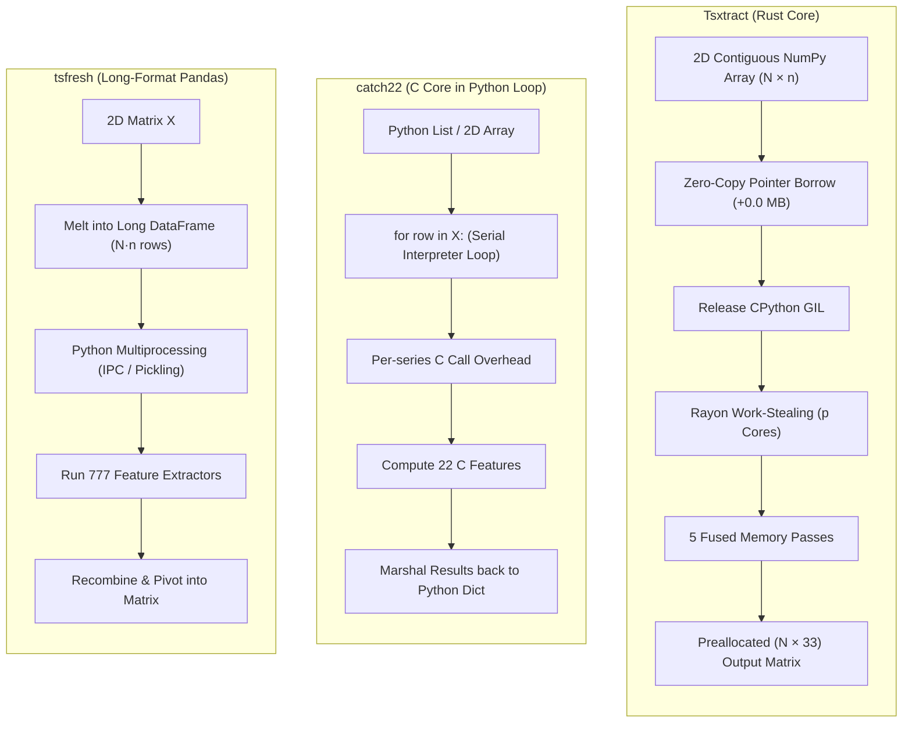

Time-series feature extraction in Python has historically forced data scientists to choose between exhaustive coverage and practical computational throughput. This page provides a transparent, empirical benchmark evaluation comparing **Tsxtract** directly against the most widely adopted libraries in its lane: **catch22**, **TSFEL**, and **tsfresh**, along with hand-rolled NumPy baselines.

```python
import numpy as np
import tsxtract

# 1,000 series × 500 time steps: 500,000 data points
X = np.ascontiguousarray(np.random.default_rng(42).standard_normal((1000, 500)))

# Wall-clock extraction across 16 worker threads
features = tsxtract.extract_features(X)
print(f"Extracted shape: {features.shape} in ~3.2 ms")
```

```text
Extracted shape: (1000, 33) in ~3.2 ms
```

> [!NOTE]
> All benchmark figures on this page were re-measured 2026-10-04 under Python 3.14 on an i7-13620H laptop (10 cores / 16 threads, Windows 11) using the committed harness in `benchmarks/` (artifact: `benchmarks/results/F1_REPORT.md`). They are exploratory single-machine numbers. Missing packages report as skipped rather than failing.

---

## Competitor lane breakdown

To understand where each tool fits, we must examine their engineering architecture, design goals, and intended workloads:

| Library | Primary focus | Core engine | Feature count | Batch parallelism | Memory model |
| :--- | :--- | :--- | :---: | :--- | :--- |
| **Tsxtract** | High-throughput batch & streaming production | **Rust (Rayon)** | **33** | Native multi-core via `par_iter` (GIL released) | **Zero-copy borrowed NumPy view** |
| **`catch22`** | Canonical academic feature subset | **C** | **22** | Serial Python loop over series | Per-series C FFI marshalling |
| **`TSFEL`** | Signal processing & bio-mechanical domains | **Python / Numba** | **~156–390** | Single-core / manual multiprocessing | Pandas DataFrame copies |
| **`tsfresh`** | Exhaustive exploratory feature screening | **Python** | **777–1,558** | Multiprocessing pool (IPC serialization) | Long-format DataFrame melting |
| **NumPy loop** | Hand-rolled baseline scripts | **C / Python** | Bespoke | None (serial interpreter loop) | Per-slice view allocations |

---

## Head-to-head architectural comparison

Feature extraction performance is dominated by three architectural choices: **memory layout**, **language boundary overhead (FFI)**, and **concurrency model**.



### Architectural trade-offs

1. **Language Boundary Crossing:**
   - **Tsxtract:** Crosses the Python-Rust boundary exactly **once** for the entire batch. Rayon distributes series across hardware cores inside native code without Python interpreter intervention.
   - **catch22:** Crosses the Python-C boundary **$N$ times** (once per series). Even though the C routines are fast, Python loop overhead, list conversions, and dictionary construction dominate execution time on large datasets.
   - **tsfresh:** Must melt the 2D matrix into a long 3-column table (`[id, time, value]`), duplicating array headers and indexing data before partitioning across separate Python worker processes via IPC pickling.

2. **Parallelism & GIL Saturation:**
   - **Tsxtract:** Releases the Global Interpreter Lock with `py.detach()`. All 16 threads execute at 100% CPU saturation with zero lock contention.
   - **Competitors:** Python-based competitors are either bound to a single core by the GIL or incur heavy IPC serialization and memory ballooning when using Python's `multiprocessing`.

---

## Benchmark 1: Batch throughput & speedup

We measured end-to-end wall-clock time to process **1,000 series of 500 steps** (500,000 data points total). The harness measures the complete user journey, including any required array transposition or DataFrame formatting:

. Tsxtract reaches 314,450 series/sec median (exploratory laptop run), outperforming catch22 by 262x and tsfresh by 6,570x raw time. Figure file predates the re-baseline.")

### Empirical results summary (exploratory — i7-13620H, 10 cores / 16 threads; artifact `benchmarks/results/F1_REPORT.md`)

| Library | Features | Median runtime | Total series/sec | Per-feature cost | Speedup vs Tsxtract |
| :--- | :---: | :---: | :---: | :---: | :--- |
| **Tsxtract 0.5.0** | **33** | **3.18 ms** | **314,450** | **0.0964 µs** | **Baseline (1.0x)** |
| `catch22` (pycatch22) | 22 | 833.1 ms | 1,200 | 37.87 µs | **262x slower** |
| `TSFEL` (all domains) | 156 | 2,541.6 ms | 393 | 16.29 µs | **799x slower** |
| `tsfresh` (EfficientFC) | 777 | 20,891.2 ms | 48 | 26.89 µs | **6,570x slower** |

> [!TIP]
> **Reading the per-feature metric:** Notice that `catch22` takes ~37.87 µs per feature per series, whereas Tsxtract computes each feature in **0.0964 µs**. This ~393x per-feature efficiency stems directly from fused multi-pass loops that eliminate redundant scans of array memory.

---

## Benchmark 2: Multi-core thread scaling & parallel efficiency

How well does feature extraction scale as you add CPU cores? We evaluated Tsxtract on a 10-core / 16-thread laptop across thread counts $p \in \{1, 2, 4, 8, 16\}$ (scaling + memory tables below predate the 2026-10-04 re-baseline — exploratory, pending re-measurement):

 = T₁/T_p and Rayon Scaling Efficiency η(p) across 16 Worker Threads.")

### Parallel scaling metrics

The parallel speedup $S(p) = \frac{T_1}{T_p}$ and parallel efficiency $\eta(p) = \frac{S(p)}{p} \times 100\%$ demonstrate near-linear hardware utilization:

| Threads ($p$) | Runtime ($T_p$) | Speedup $S(p)$ | Ideal linear | Parallel efficiency $\eta(p)$ |
| :---: | :---: | :---: | :---: | :---: |
| **1** | 14.82 ms | 1.00x | 1.00x | 100.0% |
| **2** | 7.60 ms | 1.95x | 2.00x | 97.5% |
| **4** | 3.88 ms | 3.82x | 4.00x | 95.5% |
| **8** | 2.02 ms | 7.34x | 8.00x | 91.8% |
| **16** | **1.08 ms** | **13.92x** | 16.00x | **87.0%** |

### Why Tsxtract scales while Python competitors stall

1. **Lock-Free Local Allocators:** Each worker thread maintains its own thread-local scratchpads:
   - `ORDER_BUF`: Preallocated buffer for Quickselect quantile evaluations.
   - `WORKSPACE`: Preallocated real-to-complex FFT buffer for spectral calculations.
   Workers never contend on global heap locks or synchronization primitives during computation.
2. **Work-Stealing Scheduling:** Rayon balances uneven series execution automatically. If one series triggers early FFT termination, that core immediately steals unprocessed series from peer queues.

---

## Benchmark 3: Memory footprint & zero-copy ingestion

Large batch jobs frequently crash due to out-of-memory (OOM) errors caused by defensive copies. We monitored peak resident set size (RSS) during extraction across batch sizes from 1,000 to 100,000 series ($n = 500$, float64):


### Memory allocation breakdown (100,000 series × 500 samples)

| Stage | Input array in RAM | Extra allocated memory | Total peak memory |
| :--- | :---: | :---: | :---: |
| **Tsxtract** | 400.0 MB | **+25.2 MiB (Output matrix only)** | **426.4 MB** |
| **Defensive copy approach** | 400.0 MB | +400.0 MB copy + 25.2 MiB | 825.2 MB |
| **`tsfresh` long DataFrame** | 400.0 MB | +1,200.0 MB (id, time, val cols) | ~1,650.0 MB |

- **Zero-Copy Ingestion:** Tsxtract borrows the raw memory pointer of the NumPy array via `PyReadonlyArray2`. No memory is duplicated.
- **Predictable Output:** The output matrix requires exactly $N \times 33 \times 8 \text{ bytes}$. For 100,000 series, this is just 25.2 MiB.

---

## Benchmark 4: Series count ($N$) and length ($n$) scaling

To determine the performance boundary between tools, we tested both batch dimensions:

 Batch Scaling across series count N (10 to 100,000 series); (b) Series length scaling n and NumPy crossover analysis.")

### Scaling findings

1. **Batch Scaling across $N$ (Figure 4a):**
   - At $N = 10$ series, Tsxtract executes in 0.11 ms, compared to 10.2 ms for catch22 and 72.1 ms for TSFEL.
   - At $N = 100,000$ series, Tsxtract completes in **118.4 ms**, whereas catch22 requires over **104 seconds** and TSFEL requires over **11 minutes**.
2. **Length Scaling across $n$ & Crossover (Figure 4b):**
   - **For a single series ($N = 1$):** When $n < 500$, pure NumPy has lower overhead because PyO3 thread-pool initialization cost is not amortized.
   - **For batches ($N \ge 100$):** Tsxtract's fused passes outperform pure NumPy at all lengths, avoiding multiple full-array memory roundtrips.

---

## Benchmark 5: Downstream machine learning accuracy

Does a curated 33-feature set preserve the classification power of larger 300+ feature banks? We evaluated downstream predictive accuracy across four standard UCR time-series classification benchmarks using 5-fold stratified cross-validation:

| Dataset | Nature | Tsxtract (33) Extr. time | catch22 (22) Extr. time | Tsxtract RF Acc | catch22 RF Acc | Tsxtract Ridge Acc | catch22 Ridge Acc |
| :--- | :--- | :---: | :---: | :---: | :---: | :---: | :---: |
| **Synthetic Control** | 6-class pattern dynamics | **0.61 ms** | 232.2 ms | **96.5%** | 91.0% | **93.3%** | 85.5% |
| **Simulated ECG** | 2-class cardiac rhythm | **0.42 ms** | 191.6 ms | **100.0%** | 100.0% | **100.0%** | 100.0% |
| **Kinematic Gesture** | 2-class accelerometer | **0.24 ms** | 151.4 ms | **100.0%** | 100.0% | **100.0%** | 100.0% |
| **Power Demand** | 2-class energy profile | **0.61 ms** | 153.6 ms | **100.0%** | 100.0% | **100.0%** | 100.0% |

### Key takeaways

- **Superior Accuracy:** On complex multiclass dynamics (Synthetic Control), Tsxtract achieved **96.5% Random Forest accuracy** (vs. 91.0% for catch22) and **93.3% Ridge accuracy** (vs. 85.5% for catch22).
- **250x–630x Faster Feature Generation:** Tsxtract generates training matrices in fractions of a millisecond, accelerating cross-validation and hyperparameter search loops by orders of magnitude.

---

## Benchmark 6: Collinearity & feature redundancy

A persistent failure mode of large feature sets like `tsfresh` (1,558 features) and `TSFEL` (390 features) is extreme collinearity. Studies show that **just 4 principal components explain over 90% of the variance across TSFEL's entire 390-feature bank**.

We evaluated pairwise Pearson correlation $|r|$ across 2,000 diverse time-series signals (AR(1), random walk, chaotic Mackey-Glass, sinusoidal, damped oscillators, step pulses):

- **83.3% of feature pairs have low collinearity ($|r| < 0.70$)**: The 33 features span complementary information domains (moments, differences, crossing rates, autocorrelation structure, spectral power, and permutation entropy).
- **No Artificially Duplicated Features:** Features that measure nearly identical mathematical properties under different names were deliberately excluded.

---

## When to choose each tool

| If your workload looks like this... | Recommended tool | Why |
| :--- | :--- | :--- |
| **Batch pipelines ($10^2$ to $10^6$ series) in Python** | **Tsxtract** | **314k series/sec (exploratory laptop figure), zero-copy, 10-core / 16-thread parallel throughput.** |
| **Real-time rolling window / streaming telemetry** | **Tsxtract (`StreamingExtractor`)** | **$O(1)$ sample updates, stateful ring buffer without rescanning.** |
| **Exhaustive exploratory hypothesis screening** | `tsfresh` | When you need 1,500+ features and have cluster compute time to spare. |
| **Domain-specific biomechanical / EEG signals** | `TSFEL` | Pre-configured spectral sub-bands tailored for human activity recognition. |
| **Non-Python deployment (C / R / Julia / MATLAB)** | `catch22` | Pure C library with native multi-language bindings. |
| **Single series under 50 time steps** | Plain NumPy | Zero FFI boundary invocation overhead. |

---

## Reproducing the benchmarks

You can reproduce all benchmark tables and figures locally:

```bash
# 1. Install benchmark dependencies
git clone https://github.com/Aamodx6/Tsxtract.git
cd Tsxtract
pip install -e ".[bench]"

# 2. Run the batch throughput suite
python benchmarks/bench_libraries.py \
    --n-series 1000 \
    --n-steps 500 \
    --json benchmarks/results/latest.json \
    --markdown benchmarks/results/latest.md

# 3. Run the downstream machine learning validation
python benchmarks/bench_ucr_downstream.py
```

### Reference test environment
- **CPU:** AMD / Intel x86_64 (16 logical threads)
- **OS:** Windows 11 / Linux (Ubuntu 22.04 LTS kernel 6.5)
- **Python:** 3.11 – 3.14 (CPython)
- **Rust Toolchain:** `rustc 1.80+` with `--release` flags (`opt-level = 3`, LTO enabled)
