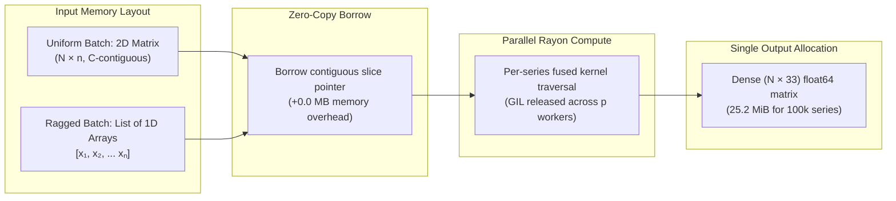
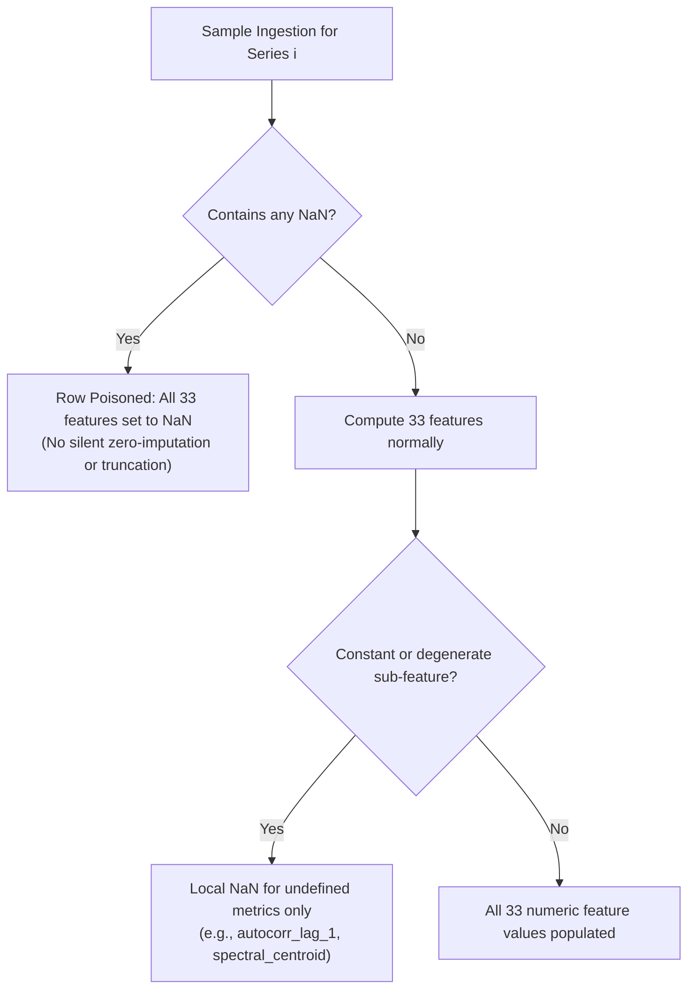

This page explains the mental model behind Kymora: what counts as a series, which array layouts the Rust core accepts, how missing and infinite values behave, and what guarantees cover output order, determinism, and thread-safety.

```python
import numpy as np
import kymora
X = np.ascontiguousarray(np.arange(12.0).reshape(3, 4))
feats = kymora.extract_features(X)
print(feats.shape)
print(kymora.feature_names()[:3])
print(feats[:, 0])
```

```text
(3, 33)
['mean', 'std', 'var']
[1.5 5.5 9.5]
```

## Time series and features

A time series is one ordered sequence of measurements, such as a single sensor channel sampled over time. A feature is one scalar summarizing that sequence, such as its mean or its autocorrelation at lag 1.

Kymora maps every input series to exactly 33 float64 features, so a batch of `n` series always yields an `(n, 33)` matrix. The mapping is pure: it depends only on the values in that one series, never on its neighbors, its position in the batch, or any hidden state.

## Input shapes and dtypes

The core accepts two input forms, both requiring `float64` data:

- **Uniform batch:** a 2D C-contiguous `float64` array of shape `(n_series, length)`. Each row is one series and all rows share one length.
- **Ragged batch:** a Python list of 1D `float64` arrays with independent lengths. Each member must itself be contiguous.




Dtype and layout rules are strict because the core borrows buffers without copying:

- **Float64 and float32:** integer, `float16`, and other dtypes raise `TypeError`. Convert once with `X.astype(np.float64)`. Contiguous `float32` is read natively with float64 accumulation.
- **C-contiguous only:** strided views such as `X[:, ::2]` raise `ValueError`. Repair with `np.ascontiguousarray(X)`.
- **No empty input:** zero rows, zero columns, or a zero-length member raises `ValueError` naming the offending index.
- **Single series:** reshape 1D input to `(1, length)` for `extract_features()`, since a bare 1D array raises `TypeError`.

```python
import numpy as np
import kymora
x = np.arange(8.0)
try:
    kymora.extract_features(x)
except TypeError as exc:
    print("TypeError:", str(exc)[:60])
print(kymora.extract_features(x.reshape(1, -1)).shape)
```

```text
TypeError: extract_features expects a 2D float64 array of shape (n_se
(1, 33)
```

## Ragged sequences

A ragged batch is a list of 1D arrays with different lengths, used when recordings have unequal durations. Padding with zeros would corrupt variance, quantiles, and autocorrelations, so Kymora handles the true lengths directly.

```python
import numpy as np
import kymora
rng = np.random.default_rng(3)
ragged = [np.ascontiguousarray(rng.standard_normal(n)) for n in (60, 200, 120)]
out = kymora.extract_features(ragged)
print(out.shape)
```

```text
(3, 33)
```

Ragged rules to remember:

- **Per-member contiguity:** a strided member raises `ValueError` reporting its list index.
- **Independent lengths:** every other validation and NaN rule applies per member exactly as in the uniform path.
- **Identical math:** ragged and uniform paths call the same per-series routine, so equal values give equal features in either form.

## NaN and inf handling

NaN is a value with a documented propagation contract, locked down by `tests/test_nan_policy.py`. Infinity is an ordinary float64 that flows through arithmetic on its own terms:



- **Any NaN poisons its row:** one NaN anywhere makes all 33 features of that series NaN, with no silent imputation, dropping, or zero-filling.
- **Rows stay independent:** a NaN row never affects its batch neighbors, and survivors are bit-identical to extracting them alone.
- **Undefined single features stay local:** autocorrelation or spectral features of a constant series, or change features of a length-1 series, are NaN individually while the rest of the row computes normally.
- **Inf is not NaN:** infinite input never raises and never triggers the all-NaN row; it propagates through formulas such as `max` naturally.
- **Empty is an error:** a zero-length series raises `ValueError` instead of producing a NaN row.

```python
import numpy as np
import kymora
names = kymora.feature_names()
poisoned = kymora.extract_features([np.array([1.0, 2.0, np.nan, 4.0])])[0]
print("NaN row is all NaN:", bool(np.isnan(poisoned).all()))
const = kymora.extract_features([np.full(10, 3.7)])[0]
d = dict(zip(names, const))
print("Constant mean/std:", d["mean"], d["std"])
print("Constant skew/autocorr_1:", d["skewness"], d["autocorr_lag_1"])
print("Constant trend_slope/cid_ce:", d["trend_slope"], d["cid_ce"])
```

```text
NaN row is all NaN: True
Constant mean/std: 3.7 0.0
Constant skew/autocorr_1: nan nan
Constant trend_slope/cid_ce: 0.0 0.0
```

> [!NOTE]
> `var` and `std` of an exactly-constant series are forced to precisely `0.0`, not float-noise residue. That exact zero is what gates the undefined-feature set above.

## Feature categories

The 33 features fall into six groups, each with a one-line role:

- **Stats (14):** location, spread, and shape of the value distribution (`mean` through `root_mean_square`).
- **Change (4):** first- and second-order dynamics between consecutive samples.
- **Counts (5):** zero/mean crossings, peaks, and longest runs above or below the mean.
- **Correlation (6):** autocorrelations at lags 1, 2, 5, 10 plus linear trend slope and `r2`.
- **Entropy (1):** normalized permutation entropy of ordinal patterns, order 3.
- **Spectral (3):** dominant frequency, spectral centroid, and spectral entropy from a real FFT with DC excluded.

See the full definitions, formulas, and per-group complexity in [Feature Catalog](/docs/feature-catalog).

## Output layout and ordering

Every call returns a fresh C-contiguous float64 matrix with one row per input series and one column per feature. `sliding_features()` returns `(n_windows, 33)` where `n_windows == (len(X) - window) // stride + 1`, and `StreamingExtractor.compute_features()` returns a length-33 vector.

Column order is a compatibility contract, not an accident of implementation:

- **Stable within a major version:** column `i` always equals `feature_names()[i]` across releases.
- **Reordering is major:** renaming, removing, or reordering a name requires a major version bump per `CONTRIBUTING.md`.
- **Appending is minor:** a new feature may only be appended at the end, which is why user code should resolve indices via `feature_names().index(name)`.

## Determinism and thread-safety

Each series is processed by an independent pure function of its own values, with per-thread scratch buffers instead of shared state. Consequences worth relying on:

- **Deterministic output:** identical input buffers give identical feature matrices on every run, thread count, and platform.
- **Reference-tested values:** every feature is checked against NumPy/SciPy references, and `0.3.0` kept all values unchanged while getting faster.
- **Thread-safe calls:** the GIL is released for the whole compute region, so threaded Python callers get real parallelism with no interpreter-lock cap.
- **No cross-call state:** batch calls hold no Rust-side state between invocations, so concurrent `extract_features()` calls cannot interfere.

> [!WARNING]
> TODO(verify): bit-exactness across CPU architectures (x86_64 vs ARM) relies on IEEE-754 double arithmetic in a fixed accumulation order, but no cross-architecture bit-exactness run is recorded in-repo. Treat cross-machine equality as `rtol=1e-9` until verified.

## Next steps

Apply these concepts to measurement, integration, and reference detail:

- [Performance & Architecture](/docs/performance) — data flow, loop fusion, and benchmark methodology.
- [Feature Catalog](/docs/feature-catalog) — per-feature formulas and undefined cases.
- [FAQ & Troubleshooting](/docs/faq) — error-model questions and dtype fixes.
