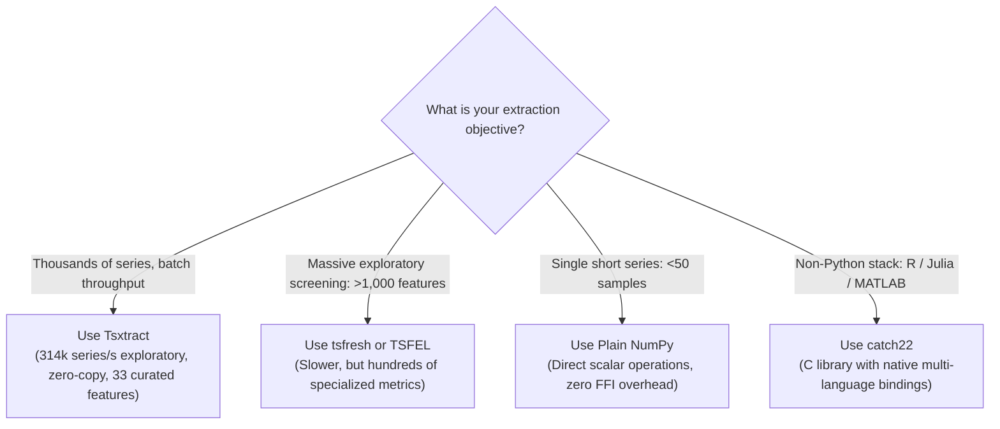

Tsxtract (distributed on PyPI as `tsxtract-rs`) is a batch time-series feature extraction library with a Rust core and an idiomatic Python interface. It computes 33 curated statistical, temporal, and spectral features across whole batches of series at once, returning a dense `(n_series, 33)` float64 matrix ready for classifiers, clustering, or retrieval.

```python
import numpy as np
import tsxtract
rng = np.random.default_rng(42)
X = rng.standard_normal((1000, 500))
features = tsxtract.extract_features(X)
names = tsxtract.feature_names()
print(features.shape)
print(names[:5])
print(np.round(features[0, :2], 4))
```

```text
(1000, 33)
['mean', 'std', 'var', 'min', 'max']
[-0.0131  0.959 ]
```

> [!NOTE]
> The Python package and import name is `tsxtract` (`import tsxtract`), installed from PyPI as `pip install tsxtract-rs`. The bare PyPI name `tsxtract` belongs to an unrelated JAX project and must not be installed in the same environment. The old `tsxtractor` import remains as a deprecated shim that warns on first use.

## What it is

A time series is a sequence of measurements in time order, such as one sensor recording or one ECG trace. Feature extraction is the process of compressing each variable-length series into a fixed-length numeric vector that downstream models can consume.

Tsxtract is an engineered feature engine built specifically for batch processing. Traditional Python feature tools loop over series one at a time in the interpreter, which serializes dispatch overhead and memory copies per series. Tsxtract instead passes the whole NumPy matrix across the Python-Rust boundary once and spreads the series over CPU cores.

The output is a compact, low-redundancy 33-column representation. Every feature is `O(n)` or `O(n log n)` by construction, so cost grows near-linearly with series length. Costly `O(n^2)` dynamical estimators are omitted by design rather than approximated.

## Who it is for

Tsxtract serves practitioners who need fast, repeatable tabularization of sequence data at batch scale:

- **IoT and industrial telemetry:** feature engineering over vibration, temperature, acoustic, and pressure signals across large sensor fleets.
- **Quantitative finance:** volatility, momentum, autocorrelation decay, and spectral descriptors across equity, FX, and order-book series.
- **Biomedical signal analysis:** rapid extraction from ECG, EEG, EMG, and wearable accelerometer cohorts for diagnostic classifiers.
- **Audio and acoustic monitoring:** energy profiles, spectral centroids, and dominant-frequency descriptors for anomaly detection.
- **High-volume batch pipelines:** ETL and training-data generation in schedulers and workers where per-core throughput directly controls infrastructure cost.

## Why a Rust core

Tsxtract delegates all numeric work to a compiled Rust engine reached through PyO3, which is the Rust binding layer between CPython and native code. Four design decisions govern this architecture:

- **Zero-copy NumPy ingestion:** inputs are borrowed through read-only views (`PyReadonlyArray2` and `PyReadonlyArray1` in `src/ffi.rs`). The underlying C-contiguous buffer addresses pass straight to Rust slices with no per-series copy.
- **Rayon batch parallelism with GIL release:** parallelism runs across the series dimension via the Rayon work-stealing thread pool in `src/extract.rs`. The GIL, which is Python's interpreter lock that normally serializes threads, is released with `py.detach()` for the whole compute region.
- **Loop-fused multi-pass engine:** features that share a traversal share it deliberately in `src/features/mod.rs`. Raw sums, extremes, and NaN/constant flags accumulate together, central moments accumulate together, and related groups reuse one scan so cache residency stays high.
- **Strict structural validation with an explicit NaN contract:** shape, length, and layout problems raise before any worker thread starts, while NaN values propagate as documented floating-point results rather than errors.


## Feature highlights

The bank prioritizes throughput, low redundancy, and determinism over exhaustive coverage:

- **Curated 33-feature bank:** 14 summary statistics, 4 rate-of-change metrics, 5 crossing and peak counts, 6 autocorrelation and trend metrics, 1 normalized permutation entropy, and 3 spectral estimators.
- **Stable column order:** `feature_names()` order is a compatibility guarantee within a major version. Column `i` always means the same feature, so serialized models and stored matrices stay aligned.
- **Native ragged input:** a list of variable-length 1D float64 arrays yields a fixed `(n_series, 33)` matrix with no padding or truncation.
- **Sliding and streaming windows:** `sliding_features()` vectorizes rolling windows over one long series, and `StreamingExtractor` ingests samples one at a time for real-time use.
- **Minimal runtime footprint:** the installed package depends only on `numpy>=1.24`. Pandas is an optional extra used solely by `extract_features_df()`.
- **Deterministic output:** the same input buffer produces bit-identical features on every run and platform, with no random sampling inside the engine.

## Comparison with pure Python and NumPy

A hand-rolled NumPy pipeline can compute a few moments quickly, but it re-scans the series per feature and stays single-threaded per call. The qualitative trade-offs look like this:

| Approach | Parallelism | Memory copies | Maintenance | Best for |
| :--- | :--- | :--- | :--- | :--- |
| **Tsxtract batch call** | Yes, across series via Rayon | One zero-copy view of the input | Curated closed set, tested against SciPy references | Thousands of series per batch |
| **Per-series NumPy loop** | No, serial Python loop | Per-slice views and temporaries | You own every formula and edge case | A handful of series |
| **Pandas `.apply()` per row** | No, interpreter-bound | Per-row Series objects | Concise but slow at scale | Interactive exploration |

For library-level throughput, the benchmark suite measures end-to-end batch timings on 1,000 series of 500 steps (i7-13620H laptop, 10 cores / 16 threads, Windows 11, Python 3.14 — exploratory numbers, see CLAIMS.md):

. Tsxtract executes 314,450 series/s median, compared to 1,200 for catch22, 393 for TSFEL, and 48 for tsfresh.")

| Library | Feature count | Total time | Series/s | Per-feature cost |
| :--- | ---: | ---: | ---: | :--- |
| **tsxtract** | 33 | **3.18 ms** | **314,450** | Baseline (1.0x) |
| `catch22` (pycatch22) | 22 | 833.1 ms | 1,200 | About 262x slower overall |
| `TSFEL` (all domains) | 156 | 2,541.6 ms | 393 | About 799x slower overall |
| `tsfresh` (EfficientFC) | 777 | 20,891.2 ms | 48 | About 6,570x slower overall |

Two mechanisms explain the gap, and only one is engineering:

- **Batch parallelism:** every other library above is called once per series from Python, so batch cost includes a serial loop plus per-call overhead. Tsxtract takes the whole matrix across the FFI boundary once.
- **Cheaper feature set:** all 33 features are `O(n)` or `O(n log n)` by construction. Some competitors include costlier estimators, so per-feature differences partly reflect different work, not just speed.

## When not to use this

Tsxtract is intentionally opinionated, so several workloads belong elsewhere:



- **Exhaustive feature screening:** `tsfresh` computes up to 1,558 features and `TSFEL` around 390. If you want to throw everything at a selector, use those.
- **Custom or parameterized features:** the registry in `src/features/mod.rs` is closed with no plugin hook. Use `tsfel` or plain Python functions for bespoke metrics.
- **Non-Python runtimes:** Tsxtract ships Python bindings only. R, Julia, and MATLAB users should prefer `catch22`, which publishes bindings for all three.
- **One short series at a time:** parallelism needs a batch or window dimension to split. For a single 50-sample series, plain NumPy is sufficient and simpler.

## Common pitfalls

Three input rules prevent most integration failures:

- **Non-contiguous views:** strided slices such as `X[:, ::2]` raise `ValueError`. Repair with `np.ascontiguousarray(X)` before calling.
- **Wrong dtype:** integer or `float16` arrays raise `TypeError` rather than being silently copied. Convert once with `X.astype(np.float64)`. Contiguous `float32` is read natively with float64 accumulation.
- **NaN propagation:** one NaN anywhere in a series makes all 33 of that row NaN. Impute or drop missing samples before extraction when row-level output is required.

## Next steps

Install the package and run your first extraction, then deepen specific topics:

- [Installation](/docs/installation) — wheels, supported platforms, and building from source.
- [Quickstart](/docs/quickstart) — five-minute guide from arrays to a trained classifier.
- [Benchmarks & Competitors](/docs/benchmarks) — empirical speedup, scaling curves, and competitor analysis.
- [Core Concepts](/docs/core-concepts) — memory layout, ragged input, and the NaN contract.
- [Feature Catalog](/docs/feature-catalog) — definitions and complexity for all 33 features.
