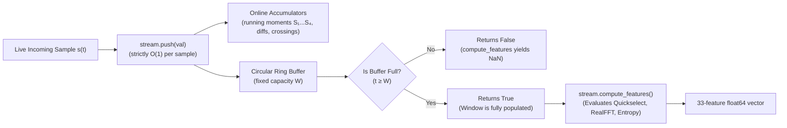
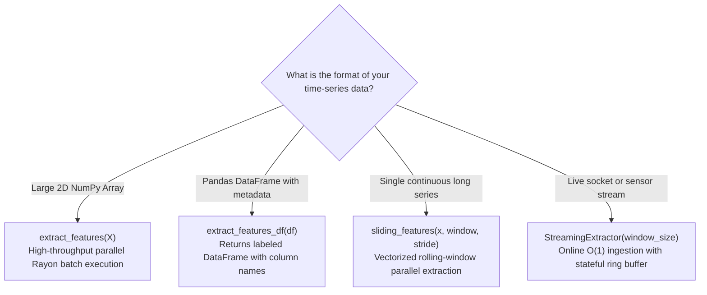

Scale beyond RAM with fixed-size chunks, turn single long recordings into window batches, and push live samples through a stateful extractor. Chunked calls concatenate to bit-identical results versus one giant call.

```python
import numpy as np
import tsxtractor
rng = np.random.default_rng(4)
big = np.ascontiguousarray(rng.standard_normal((2500, 200)))
print("Input MB:", big.nbytes / 1e6)
chunks = [tsxtractor.extract_features(big[i:i + 500]) for i in range(0, 2500, 500)]
F = np.vstack(chunks)
print("Chunked shape:", F.shape)
print("Identical to one call:", bool((F == tsxtractor.extract_features(big)).all()))
```

```text
Input MB: 4.0
Chunked shape: (2500, 33)
Identical to one call: True
```

## Goal

By the end of this guide you will be able to:

- Estimate input and output memory before allocating.
- Extract datasets larger than RAM with sequential chunks.
- Parallelize single long series with `sliding_features()`.
- Run sample-by-sample inference with `StreamingExtractor`.
- Choose between batching, windows, and streaming for a workload.

## Prerequisites

You need only the core package, plus a mental model of two terms:

- **Chunking:** splitting a batch into fixed-size row blocks processed one call at a time.
- **Rolling window:** a fixed-length slice that advances by `stride` samples across one long series.

```bash
pip install tsxtract
```

## Steps

### 1. Budget memory up front

Input bytes equal `n_series * length * 8` and output bytes equal `n_series * 33 * 8`. Measure both before choosing a chunk size that fits comfortably in RAM:

 and Series Lengths.")

```python
n_series, length = 1_000_000, 500
print("Input GB:", n_series * length * 8 / 1e9)
print("Output GB:", n_series * 33 * 8 / 1e9)
```

```text
Input GB: 4.0
Output GB: 0.264
```

### 2. Extract in sequential chunks

Loop over row blocks, extract each block independently, and stack the results. Calls hold no shared state, so chunk boundaries never change values.

```python
chunk_rows = 10_000
names = tsxtractor.feature_names()
out_blocks = []
for start in range(0, big.shape[0], chunk_rows):
    block = np.ascontiguousarray(big[start:start + chunk_rows])
    out_blocks.append(tsxtractor.extract_features(block))
F_full = np.vstack(out_blocks)
print("Reassembled:", F_full.shape, F_full.dtype)
print("First column:", names[0])
```

```text
Reassembled: (2500, 33) float64
First column: mean
```

### 3. Parallelize one long series with sliding windows

A single series offers Rayon no batch dimension, so `sliding_features()` creates one from windows. Window count follows `(len(X) - window) // stride + 1`.

```python
x = np.ascontiguousarray(rng.standard_normal(2000))
S = tsxtractor.sliding_features(x, window=256, stride=128)
print("Sliding shape:", S.shape)
```

```text
Sliding shape: (14, 33)
```

### 4. Stream samples in real time

A streaming extractor is a stateful rolling window that ingests one sample per `push()`. It reports readiness as a boolean and returns NaN vectors until the window fills:



```python
stream = tsxtractor.StreamingExtractor(window_size=16)
x = np.sin(np.linspace(0, 10, 50))
first_ready = None
for i, v in enumerate(x):
    if stream.push(float(v)):
        if first_ready is None:
            first_ready = i
        last = stream.compute_features()
print("First ready index:", first_ready)
print("Feature length:", len(last))
print("All finite:", bool(np.all(np.isfinite(last))))
batch = tsxtractor.extract_features(x[-16:].reshape(1, -1))[0]
print("Matches batch:", float(np.nanmax(np.abs(last - batch))))
```

```text
First ready index: 15
Feature length: 33
All finite: True
Matches batch: 0.0
```

### 5. Reset between independent streams

`reset()` clears the ring buffer and accumulators so one extractor object can serve consecutive sessions without reallocating.

```python
stream.reset()
print("Full after reset:", stream.is_full)
print("Push returns:", stream.push(1.0))
```

```text
Full after reset: False
Push returns: False
```

## Extraction API decision guide

Choose the optimal execution interface for your data topology:



> [!NOTE]
> Streaming matches batch windows to `rtol=1e-9` in `tests/test_streaming.py`, with periodic re-anchoring every 4,096 steps bounding floating-point drift on endless streams.

## Complete example

Chunked file-to-features conversion with a memmapped input, so a 4 GB matrix never sits fully in RAM:

```python
import numpy as np
import tsxtractor
rng = np.random.default_rng(4)
big = np.ascontiguousarray(rng.standard_normal((2500, 200)))
np.save("/tmp/series.npy", big)
mm = np.load("/tmp/series.npy", mmap_mode="r")
names = tsxtractor.feature_names()
blocks = [tsxtractor.extract_features(np.ascontiguousarray(mm[i:i + 500])) for i in range(0, mm.shape[0], 500)]
F = np.vstack(blocks)
np.save("/tmp/features.npy", F)
print("Saved:", F.shape, "columns start with:", names[:3])
print("Mean of means:", round(float(F[:, 0].mean()), 4))
```

```text
Saved: (2500, 33) columns start with: ['mean', 'std', 'var']
Mean of means: -0.0005
```

## Common pitfalls

- **Oversized single calls:** requesting a 4 GB input plus output in one call risks swapping or OOM kills. Chunk to a few hundred MB per call instead.
- **Non-contiguous chunk views:** slicing rows preserves contiguity, but column slicing does not. Wrap every block with `np.ascontiguousarray()` defensively.
- **Reading streaming output early:** `compute_features()` before the window fills returns all NaN by design. Gate reads on `push()` returning `True` or `is_full`.
- **`window_size` below 2:** constructing `StreamingExtractor(1)` raises `ValueError`. Single-sample windows carry no dynamics, so the minimum is enforced.

## Next steps

From scale to modeling and internals:

- [Scikit-Learn Pipelines](/docs/sklearn-pipelines) — train on chunked feature output.
- [Performance & Architecture](/docs/performance) — memory model and threading behavior.
- [API Reference](/docs/api-reference) — exact signatures for windowing and streaming calls.
