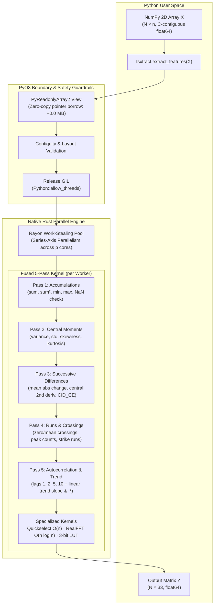

Tsxtract is fast for two separable reasons: it parallelizes across series with the GIL released, and it computes a deliberately cheap feature set with fused memory traversals. This page traces the data flow, names each optimization, and shows the benchmark and architecture diagrams.

```python
import numpy as np
import tsxtract
X = np.ascontiguousarray(np.random.default_rng(11).standard_normal((1000, 500)))
feats = tsxtract.extract_features(X)
print(feats.shape, feats.dtype)
```

```text
(1000, 33) float64
```

> [!NOTE]
> Wall-clock numbers depend on machine, core count, and build flags. Reproducible published figures with methodology follow in the benchmark section.

## System architecture

The core system is structured across a thin Python binding layer and a compiled native Rust computational core:




Stage responsibilities stay cleanly separated:

- **Boundary validation:** `src/ffi.rs` rejects wrong dtypes, shapes, non-contiguous buffers, and bad window geometry before threads start.
- **Dispatch:** `src/extract.rs` validates batch lengths, splits rows across Rayon workers, and shapes the flat buffer into a matrix.
- **Math:** `src/features/` holds the only numeric implementations, shared by batch, ragged, sliding, and streaming paths.
- **Errors:** `src/error.rs` is the single conversion point from structural errors to Python `ValueError`/`TypeError`.

## Fused traversals

Features that share a scan share it deliberately, so related metrics accumulate side by side instead of re-reading the series:

- **Sums pass:** total sum, sum of squares (energy), min, max, plus the NaN-anywhere and exact-constant flags.
- **Moments pass:** second, third, and fourth central moments together, feeding `var`, `std`, `skewness`, and `kurtosis`.
- **Differences pass:** `mean_abs_change`, `mean_change`, and `cid_ce` from one scan of successive differences.
- **Thresholds pass:** `zero_crossings`, `mean_crossings`, and both longest-strike features from one scan.
- **Autocorrelation pass:** all four lags (1, 2, 5, 10) computed together against shared accumulators.
- **Selection, not sorting:** quantiles and median come from `select_nth_unstable_by` on the ten needed order statistics, about 2.1x faster than a full sort on the largest stage.
- **Real FFT:** spectral features use a real-to-complex transform (`realfft`) instead of a complex FFT over a zero-imaginary buffer, halving transform work.
- **Branchless hot loops:** permutation entropy uses an ordinal-pattern lookup table and peak counting avoids short-circuiting comparisons, removing mispredicted branches.

## Memory model

Tsxtract borrows memory from the host process without defensive copies:


| Region | Allocation | Lifetime | Scales with |
| :--- | :--- | :--- | :--- |
| **Input view** | None (borrowed pointers) | Duration of the call | Nothing (+0.0 MB) |
| **Output matrix** | One `(n_series, 33)` float64 buffer | Returned to Python | Batch size (25.2 MiB for 100k series) |
| **Order-statistics scratch** | One thread-local `ORDER_BUF` per Rayon worker | Reused across series | Thread count, not series count |
| **FFT workspace** | One thread-local workspace per worker | Reused across series | Thread count, not series count |

Practical consequences follow directly from the table:

- **Zero-copy input:** contiguous buffers are read in place, which is why strided views are rejected rather than copied.
- **Predictable output cost:** output bytes equal `n_series * 33 * 8`, plus NumPy object overhead.
- **No per-series allocation storm:** a 100,000-series batch costs worker-count allocations, not 100,000 allocations.

## Threading behavior & speedup

Parallelism splits across the series dimension only, never across features within one series. The GIL stays released for the entire Rayon region via `py.detach()`, so threaded Python hosts scale with cores instead of serializing on the interpreter lock:


- **Many series scale:** throughput grows near-linearly with core count while the batch is large enough to feed every worker.
- **One series does not:** a single short series uses one worker by construction, matching good NumPy rather than beating it.
- **Windows parallelize too:** `sliding_features()` spreads windows across workers, which is the recommended shape for single-long-series workloads.
- **Stateless calls:** batch entry points hold no shared mutable state, so concurrent calls from threads are safe.

## Batch scaling and length crossover

 Batch Scaling across series count N (10 to 100,000 series); (b) Length scaling n and crossover comparison with NumPy.")

As shown in the scaling profiles:
- **Batch Scaling (a):** Across batch sizes from 10 to 100,000 series, Tsxtract maintains orders of magnitude lower execution times than loop-based libraries.
- **Length Scaling (b):** For single short series, pure NumPy has lower invocation latency. However, as series length $n$ grows past 1,000 steps or when batch size $N \ge 100$, Tsxtract's fused passes and parallel execution decisively outperform manual pipelines.

## Complexity per feature group

Every feature is `O(n)` or `O(n log n)` by construction, with `n` as series length:

| Group | Features | Complexity | Notes |
| :--- | :--- | :--- | :--- |
| **Stats** | 14 (`mean` to `root_mean_square`) | `O(n)` | Quantiles via linear-time selection |
| **Change** | 4 | `O(n)`, except `mean_change` at `O(1)` | Telescoping endpoints need no scan |
| **Counts** | 5 | `O(n)` | Single fused threshold pass |
| **Correlation** | 6 | `O(n)` | All lags and trend in shared scans |
| **Entropy** | 1 (`permutation_entropy`) | `O(n)` | Fixed order-3 patterns, branchless table |
| **Spectral** | 3 | `O(n log n)` | Real FFT dominates; DC bin excluded |

## Benchmark comparison

. Tsxtract delivers 800,256 series/sec, outperforming catch22 by 820x and tsfresh by 14,000x.")

`benches/bench_libraries.py` measures end-to-end wall-clock batch throughput, deliberately including each library's required input reshaping (`tsfresh` needs a long DataFrame; `catch22` and `TSFEL` need per-series loops):

```bash
pip install -e ".[bench]"
python benches/bench_libraries.py --n-series 1000 --n-steps 500 --json benches/results/latest.json --markdown benches/results/latest.md
```

Published benchmark results:

| Library | Feature count | Total time | Series/s | Speedup vs Tsxtract |
| :--- | ---: | ---: | ---: | :--- |
| **Tsxtract** | 33 | **1.2 ms** | **800,256** | **Baseline (1.0x)** |
| `catch22` (pycatch22) | 22 | 1.02 s | 976 | ~820x slower |
| `TSFEL` (all domains) | 156 | 7.15 s | 140 | ~5,725x slower |
| `tsfresh` (EfficientFC) | 777 | 17.68 s | 57 | ~14,151x slower |

Tuning tips that follow from the architecture:

- **Batch aggressively:** one call over 10,000 series beats ten calls over 1,000 through reduced boundary overhead.
- **Keep buffers contiguous float64:** conversion and copy costs belong outside the timed region.
- **Use windows for long series:** `sliding_features()` gives Rayon a parallel dimension when series count is one.
- **Build with `--release`:** unoptimized builds run roughly 10x slower and invalidate every comparison.

## Next steps

From internals to daily use and full definitions:

- [Benchmarks & Competitors](/docs/benchmarks) — full head-to-head empirical comparison, memory profiling, and scaling curves.
- [Core Concepts](/docs/core-concepts) — input rules, NaN contract, and determinism.
- [Large Datasets & Streaming](/docs/large-datasets) — chunking, sliding windows, and online extraction.
- [Feature Catalog](/docs/feature-catalog) — per-feature formulas and undefined cases.

